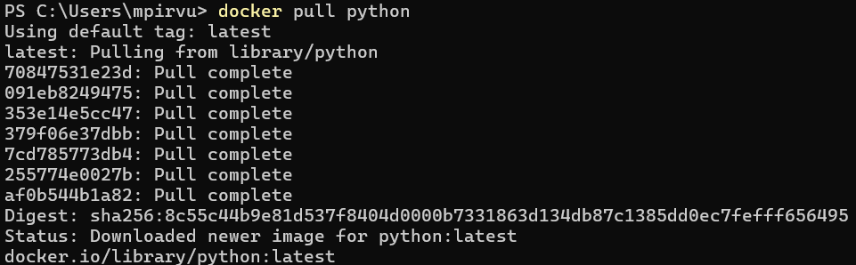
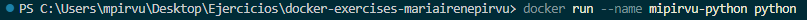
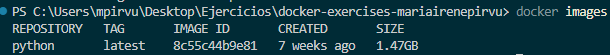
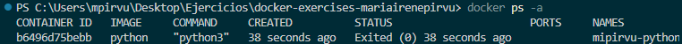
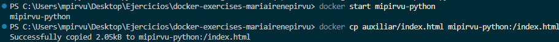
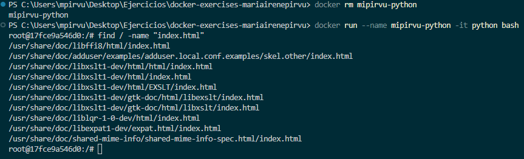
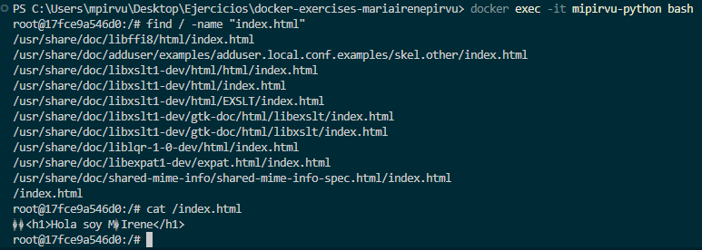
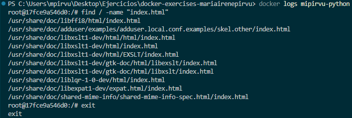
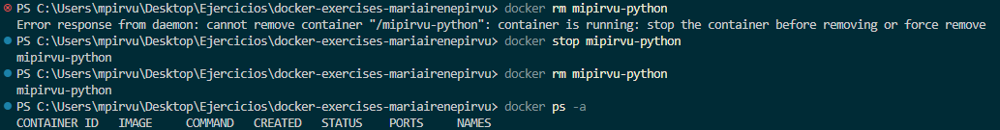
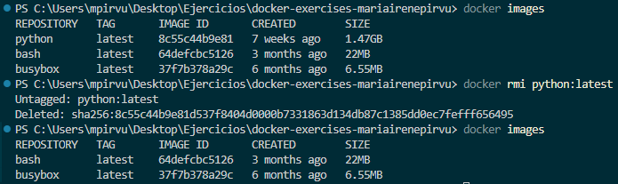

# Ejercicio 1 - Introducción
## Objetivos
1. Conocer el comando  que nos permita bajarnos una imagen de un registry local y verificar que se nos guarda en local.
2. Conocer el comando  para listar los contenedores.
3. Conocer los comandas de ejecución, parada y borrado de contenedores.

## Consideraciones
 1. En la carpeta `soluciones` se creará una carpeta con el siguiente formato  `<vuestro nombre>-Ejercicio-1`.
 2. En esa carpeta se dejará el dockerfile creado y en un archivo llamado `README_ej01.md` con los comandos utilizados con sus salidas por pantalla.

## Tarea
1. Utilizar el comando que nos permite bajarnos una imagen para tenerla en local. La selección de la imagen os la dejo a vosotros. 
   
    >[!TIP] Recomendación.
    Estaría muy interesante que uséis [dockerHub](https://hub.docker.com/), un repositorio público de imágenes y seleccionarais una que os guste. Pero si no sabéis usar una llamada 'ubuntu'. La idea es que exploreis.

`docker pull python`

2. Obtenido la imagen, desplegar el contenedor con la nomenclatura  `<vuestro nombre>-<nombre imagen>`.

`docker run --name mipirvu-python python`

3. Usar el comando para listar las imagenes.

`docker images`

4. Usar el comando para listar los contenedores y su estado.

`docker ps -a`

5. Crea en tu ordenador un fichero llamado "index.html" y copialo dentro del contenedor, con el comando correspondiente.

`echo "<h1>Hola soy MªIrene</h1>" > index.html`

Iniciamos el contenedor ya que esta detenido y así no podemos copiar nada dentro.

`docker start mipirvu-python`

Copiamos 

`docker cp auxiliar/index.html mipirvu-python:/index.html`

6. Usar el comando que os permita meteros por consola al contenedor y verificar que el archivo fue copiado con éxito. Luego, haced cualquier otro comando. Me sirve cualquiera.

Al ejectar el comando `docker exec -it mipirvu-python bash` me daba error ya que el contenedor estaba detenido, al iniciarlo nuevamente me volvía a salir el mismo error. Por esta razon ejecuté los siguientes comandos:

`docker rm mipirvu-python`

`docker run --name mipirvu-python -it python bash`

Ejecuto el comando `find / -name "index.html"`dentro del contenedor.

No aparece el fichero ya que tuve que borrar el contenedor. Vuelvo a copiarlo.

Ejecuto `cat /index.html` para además de comprobar que está copiado correctamente, comprobar su contenido.

7. Consultar los logs del contenedor, con el comando que corresponda.

`docker logs mipirvu-python`

8. Eliminar el contenedor.
Detengo el contenedor y posteriormente lo elimino.
`docker stop mipirvu-python`
`docker rm mipirvu-python`

9. Eliminar la imagen de vuestro registry local.

`docker rmi pyhon:latest`

