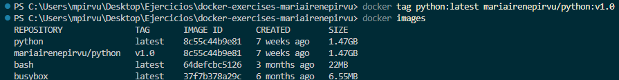
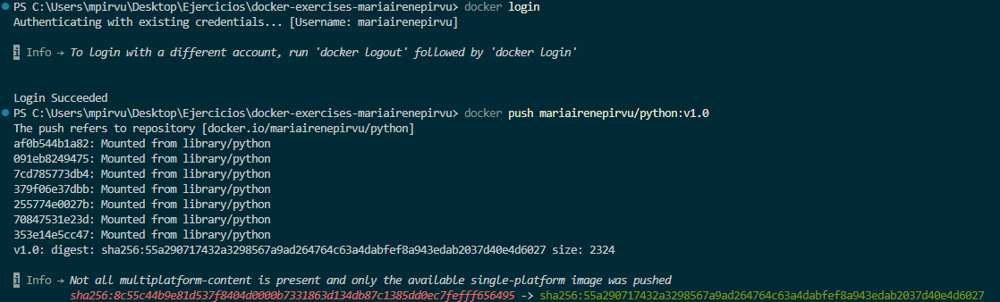
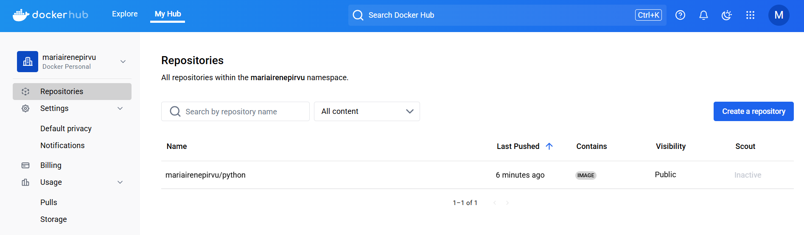

# Ejercicio 3 - Retagging y Push de Imágenes a DockerHub
## Objetivo 
Aprender a retaggear una imagen de Docker y subirla a tu cuenta personal de Docker Hub.

## Consideraciones
 1. En la carpeta `soluciones` se creará una carpeta con el siguiente formato  `<vuestro nombre>-Ejercicio-3`.
 2. En esa carpeta se dejará el dockerfile creado y en un archivo llamado `README_ej03.md` con los comandos utilizados con sus salidas por pantalla.

## Tarea
1. Retaggea la imagen descargada en el Ejercicio 1. Respeta el formato correspondiente. Define un número de versión.

`docker tag python:latest mariairenepirvu/python:v1.0`

2. Sube la imagen a tu cuenta propia en el registry de Docker.

Nos aseguramos de estar logueados en nuestra cuenta de Docker `docker login`

Seguidamente ejecutamos `docker push mariairenepirvu/python:v1.0`

3. Verificar la Imagen en Docker Hub.

Nos dirigimos a **Cuenta personal > Repositories** y ahí encontramos nuestra imagen.

4. Adjunta capturas de todo el proceso .

