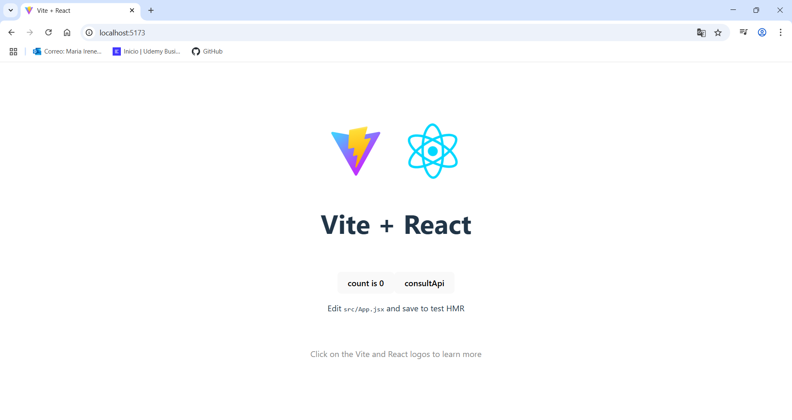

# Ejercicio 4 - Creación de imagenes y despliegue de contenedor
## Objetivos
- Familiarse con comandos básicos de docker.
- Preparación básica de un dokerfile.
- Creación de una imagen de docker válida.
- Desplegar un contenedor.

## Consideraciones
 1. En la carpeta `soluciones` se creará una carpeta con el siguiente formato  `<vuestro nombre>-Ejercicio-4`.
 2. En esa carpeta se dejará el dockerfile creado y en un archivo llamado `README_ej04.md` con los comandos utilizados y con sus salidas por pantalla. Ejemplo:
 ``` 
 > docker ps
 CONTAINER ID   IMAGE                                                  COMMAND                  CREATED        STATUS        PORTS                  NAMES
 1d5f6384f902   harbor.thelmalouise.ddns.net/docker_test/nginx:0.0.1   "/docker-entrypoint.…"   23 hours ago   Up 23 hours   0.0.0.0:8080->80/tcp   mi_nginx
 
 ```
 3. El ejercicio consta de dos proyectos por separado escritos en nodejs, uno actua de backend y el otro de fronend.
    
    1. ./datos/Ejercicio04/ui-web  -> Frontend
    1. ./datos/Ejercicio04/api-web -> Backend
    
    Dentro irá el dokerfile correspondiente, ajustado a las necesidades de cada proyecto. Os lo tenéis que traer en local y generar el dockerfile.
    >[!TIP] Instrucciones para poner en marcha el proyecto de ui-web
    ```
    > yarn
    > yarn dev --host
     ```
    >[!TIP] Instrucciones para poner en marcha el proyecto de api-web
    ```
    > npm install
    > node index.js
     ```

## Tarea
 1. Crear los fichero dockerfile en cada proyecto.

### api-web

```bash

# Imagen Node.js
FROM node:current-alpine3.21

# Directorio de trabajo
WORKDIR /app

# Copiar los archivos 
COPY package*.json ./

# Copiar el resto de los archivos
COPY . .

# Instalaciones necesarias
RUN npm install

# Exponer el puerto 3000
EXPOSE 3000 

# Comando para iniciar la aplicación
CMD ["node", "index.js"]

```

### ui-web

```bash
# Imagen Node.js
FROM node:current-alpine3.21

# Directorio de trabajo 
WORKDIR /app

# Copiar los archivos   
COPY package*.json ./

# Copiar el resto de los archivos
COPY . .

# Instalaciones necesarias
RUN yarn install

# Exponer el puerto 
EXPOSE 5173

# Comando para iniciar la aplicación
CMD ["yarn", "dev", "--host"]   
```


 2. Ejecutar los comandos necesarios para generar las imágenes.
 Realizar el retag de la imágenes para que sea con la siguiente nomenclatura `<vuestro nombre>/<nombre proyecto>:0.0.1`

Añado el **.** al final del docker build para indicar que el lanzamiento se lanza en la carpeta en la que estoy actualmente.

 `docker build -t mirene/api-web:0.0.1 .`
 
 

 `docker build -t mirene/ui-web:0.0.1 .`


 3. Sacar una captura de pantalla del listado de imágenes, con el objetivo de comprobar que la imagen se ha creado y nombrado de forma correcta.
 `docker images`

 

 4. Desplegar 2 contenedores, uno el front y el otro el back.(!!ojo con los puertos )

`docker run -d -p 3000:3000 --name api-web mirene/api-web:0.0.1`

`docker run -d -p 5173:5173 --name ui-web mirene/ui-web:0.0.1`


 

 5. Listar mediante comandos los contenedores existentes.

`docker ps`

 

 6. Usar el navegador para verificar el funcionamiento.

 Accedemos a http://localhost:5173/
 
 Accedemos a http://localhost:3000/
 

 7. Eliminar los contenedores.

Primero detenemos los contenedores 
`docker stop api-web`

`docker stop ui-web`

`docker rm api-web`

`docker rm ui-web`


 8. Eliminar las imágenes.

`docker rmi mirene/api-web:0.0.1`

`docker rmi mirene/ui-web:0.0.1`

