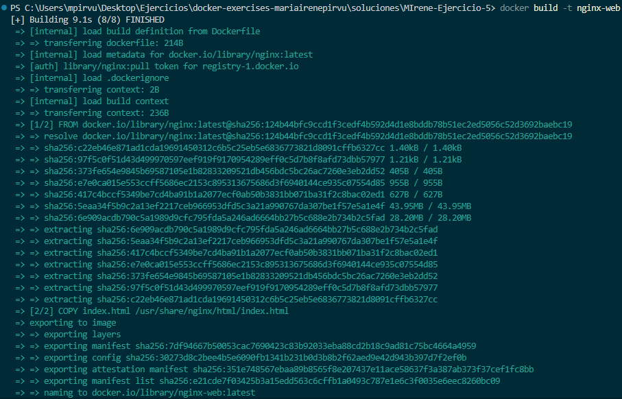
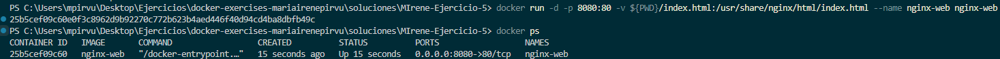
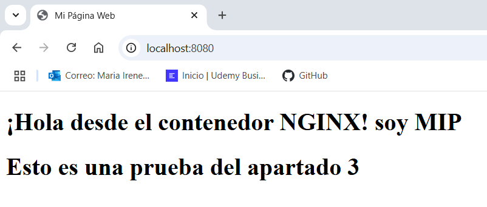
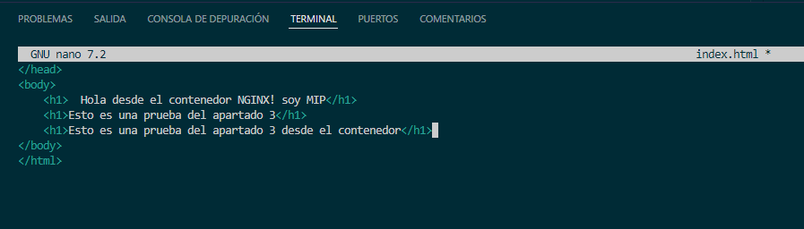
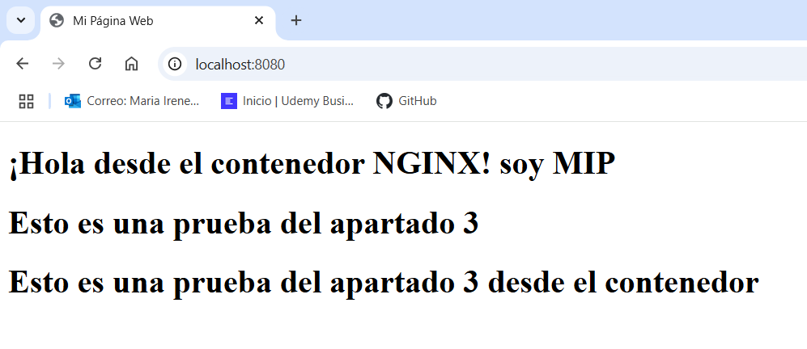

# Ejercicio 5 - Gestión de volúmenes en un Contenedor NGINX

## Objetivo
El objetivo de este ejercicio es que los estudiantes aprendan a utilizar Docker para crear un contenedor que sirva archivos web mediante NGINX, explorando la gestión de volúmenes para permitir la sincronización de archivos entre el sistema host y el contenedor, de modo que los cambios realizados en el archivo index.html se reflejen automáticamente en el servidor web sin necesidad de reiniciar el contenedor.

## Consideraciones
 1. En la carpeta `soluciones` se creará una carpeta con el siguiente formato  `<vuestro nombre>-Ejercicio-5`.
 2. En esa carpeta se dejará el dockerfile creado y en un archivo llamado `README_ej05.md` con los comandos utilizados con sus salidas por pantalla.

## Tarea
1. Crea un Dockerfile que use una imagen base de NGINX para crear un contenedor que sirva archivos web.
```bash
# Uso de la imagen oficial de NGINX
FROM nginx:latest

# Copiar el archivo index.html
COPY index.html /usr/share/nginx/html/index.html

# Exponer el puerto 
EXPOSE 80
```

2. Crear un fichero index.html. El contenedor debe compartir con tu maquina local la carpeta donde se encuentra el fichero index.html.

```bash 
<!DOCTYPE html>
<html lang="es">
<head>
    <meta charset="UTF-8">
    <title>Mi Página Web</title>
</head>
<body>
    <h1>¡Hola desde el contenedor NGINX! soy MIP</h1>
</body>
</html>
```

3. Cualquier cambio realizado en el archivo index.html, tanto desde dentro de la carpeta en tu máquina local como desde dentro del contenedor, debe reflejarse automáticamente en el servidor web del contenedor. Editar el archivo de ambas formas y verificar.

`docker build -t nginx-web .`



Ejecutamos el contenedor y montamos el volumen para que el archivo index.html local se sincronice con el del contenedor.

`docker run -d -p 8080:80 -v ${PWD}/index.html:/usr/share/nginx/html/index.html --name nginx-web nginx-web`



Accedemos a http://localhost:8080


Prueba desde local 



Prueba desde contenedor 

`docker exec -it 25b5cef09c60 bash` 

Terminal del contenedor 


