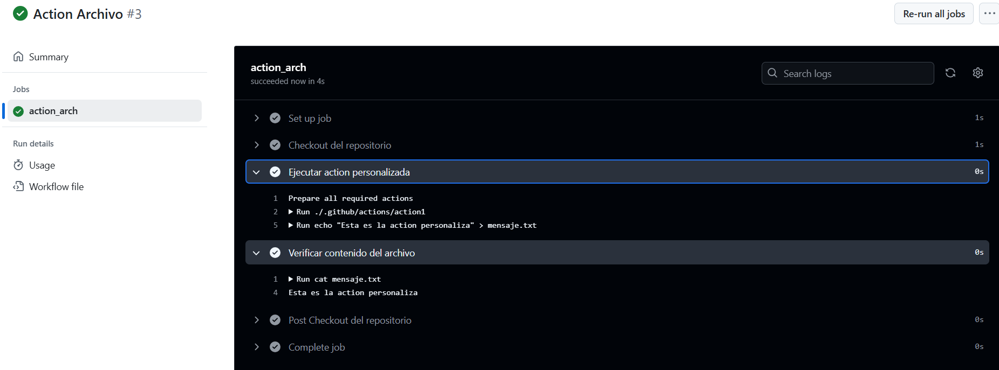

# Actions - Ejercicio 1

## Crear una action personalizada que sea capaz de crear un archivo de texto en el directorio raíz del repositorio con un mensaje


#
Creo el workflow en base al action. Este crea un archvio con un mensaje, el workflow se encarga de lanzar esa acción. 
Aunque el enunciado no lo requiera, utilizo composite porque me parece más sencillo. 

## Workflow 

```yml
# Nombre del workflow
name: Action Archivo 

# Evento para lanzar el Workflow manualmente
on:
  workflow_dispatch:

# Jobs a ejecutar
jobs:
  action_arch:
    runs-on: ubuntu-latest  # Runner de Ubuntu 
    steps:
      - name: Checkout del repositorio
        uses: actions/checkout@v3
  
      - name: Ejecutar action personalizada
        uses: ./.github/actions/action1
        with:
          mensaje: "Esta es la action personaliza"
      
      - name: Verificar contenido del archivo
        run: cat mensaje.txt
```

## Action Personalizada 

```yml
name: "Crear Archivo"
description: "Archivo de texto con mensaje"
inputs:
  mensaje:
    description: "Mensaje archivo"
    required: true
runs:
  using: "composite"
  steps: 
    - name: Creación archivo 
      shell: bash
      run: echo "${{ inputs.mensaje }}" > mensaje.txt 
```

## Comprobación 



