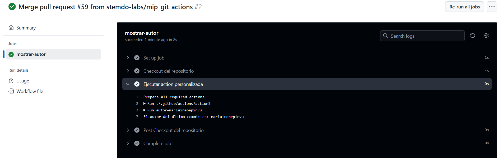

# Actions - Ejercicio 2

## Crear una custom action usando composite actions que imprime el nombre del autor del último commit en los logs del workflow


#
Utilizo composite actions con run y shell.
Imprimo el nombre del autor con contexts por lo tanto lanzo el workflow con push (en la rama main) ya que así lo requiere. Normalmente utilizo "workflow_dispatch".

## Workflow
```yml
# Nombre del workflow
name: Mostrar Autor del Commit

# Evento para lanzar el Workflow con push 
on:
  push:
    branches:
      - main

# Jobs a ejecutar
jobs:
  mostrar-autor:
    runs-on: ubuntu-latest  # Runner de Ubuntu

    steps:
      - name: Checkout del repositorio
        uses: actions/checkout@v3

      - name: Ejecutar action personalizada
        uses: ./.github/actions/action2
```


## Action 
```yml
# Nombre del action
name: "Mostrar autor del último commit"
description: "Imprime el nombre del autor del último commit"

runs:
  using: "composite"
  steps:
    - name: Obtener autor último commit
      shell: bash
    # Haciendo uso de contexts saco el autor del último commit y lo muestro por pantalla
      run: |
        autor=${{ github.event.head_commit.author.name }}
        echo "El autor del último commit es: $autor"


```

## Comprobación 

