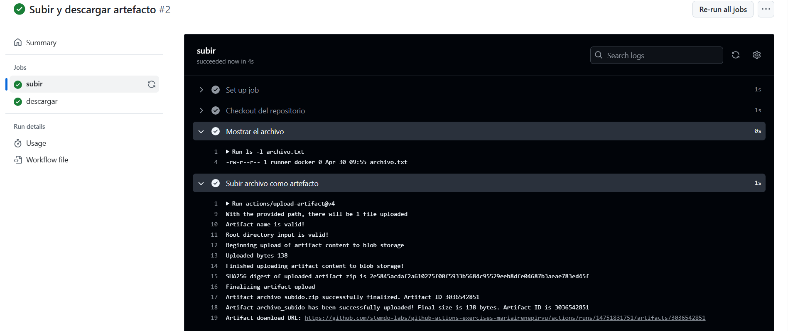
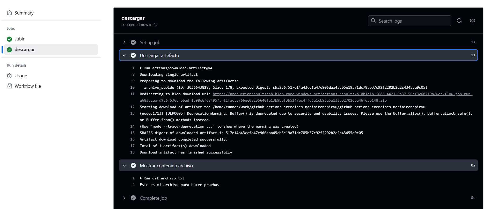

# Actions - Ejercicio 3

## Crear un workflow que suba un archivo existente en el repositorio como un artefacto, y luego lo descargue y muestre su contenido en una tarea posterior


#
Utilizo como artefacto el archivo creado en el ejercicio 1. <br>
En este ejercicio no necesito de un archivo "action.yml" ya que utilizo acciones predefinidas. Las actiones que utilizo son:
* actions/checkout@v3 -> Hace checkout del código del repositorio.
* actions/upload-artifact@v4 -> Sube un archivo como artefacto.
* actions/download-artifact@v4 -> Descarga un artefacto anteriormente subido.


## Workflow

```yml

# Nombre del workflow
name: Subir y descargar artefacto

# Evento para lanzar el Workflow manualmente
on:
  workflow_dispatch:

# Jobs a ejecutar
jobs:
  # Subir archivo como artefacto 
  subir:
    runs-on: ubuntu-latest  # Runner de Ubuntu
    steps:
      - name: Checkout del repositorio
        uses: actions/checkout@v3
  
      - name: Mostrar el archivo 
        run: ls -l archivo.txt

      - name: Subir archivo como artefacto
        uses: actions/upload-artifact@v4
        with:
          name: archivo_subido
          path: archivo.txt
          
  # Descargar archivo y mostrar su contenido
  descargar:
    needs: subir  # Este depende de "Subir"
    runs-on: ubuntu-latest # Runner de Ubuntu
    steps:
      - name: Descargar artefacto
        uses: actions/download-artifact@v4
        with:
          name: archivo_subido
          path: ./

      - name: Mostrar contenido archivo
        run: cat archivo.txt

```

## Subir



## Descargar

