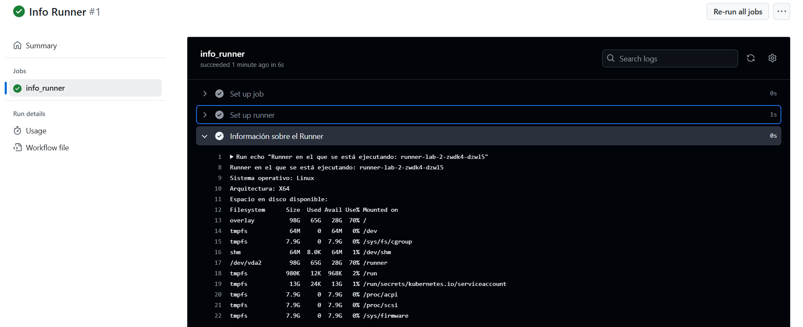

# Contexts - Ejercicio 1

## Configura un workflow que imprima información sobre el runner en el que se está ejecutando el job, como el nombre del sistema operativo, la arquitectura, y el espacio en disco disponible

#

En este workflow utilizo las propiedades que encuentro en la documentación de GitHub Actions. Para mostrar el espacio de disco no encontré ninguna propiedad, parece ser que esto se debe a que los contexts solo contienen información predefinida y no infomración que puede fluctuar. 

## Workflow
```yml
# Nombre del workflow
name: Info Runner

# Evento para lanzar el Workflow manualmente
on:
  workflow_dispatch:

# Jobs a ejecutar
jobs:
  info_runner:
    runs-on: labs-runner # Runner de Stemdo
    steps:
      - name: Información sobre el Runner
        # Imprimo el nombre, sistema operativo, arquitectura y espacio de disco (por comandos). 
        run: |
          echo "Runner en el que se está ejecutando: ${{ runner.name }}"
          echo "Sistema operativo: ${{ runner.os }}"
          echo "Arquitectura: ${{ runner.arch }}"
          echo "Espacio en disco disponible:"
          df -h

```
## Comprobación 
