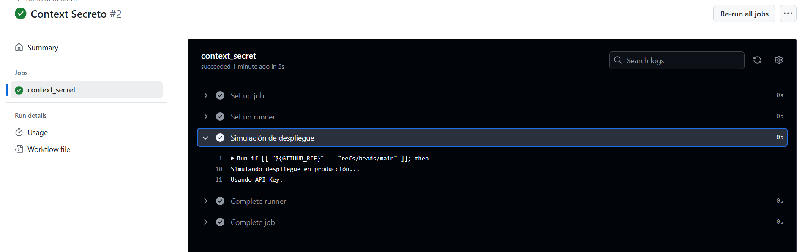

# Contexts - Ejercicio 2

## Configura un workflow que utilice un secreto llamado PROD_API_KEY para realizar un despliegue ficticio si se ejecuta en la rama main, y otro secreto llamado STAGING_API_KEY para cualquier otra rama

**El workflow debería:**

- Utilizar el contexto secrets para inyectar la API Key correspondiente en un comando de despliegue ficticio.
- Imprimir un mensaje indicando cuál API Key se utilizó.


# 
Utilizo los secretos ${{ secrets.PROD_API_KEY }} y ${{ secrets.STAGING_API_KEY }} para el despliegue ficticio. 


## Workflow

```yml
# Nombre del workflow
name: Context Secreto 

# Evento para lanzar el Workflow manualmente
on:
  workflow_dispatch:

# Jobs a ejecutar
jobs:
  context_secret:
    runs-on: labs-runner # Runner de Stemdo
    steps:
      - name: Simulación de despliegue
        # Realizamos una simulación comprobando la rama con GITHUB_REF y utilizando secrets.<secret_name>
        run: |
          if [[ "${GITHUB_REF}" == "refs/heads/main" ]]; then
            echo "Simulando despliegue en producción..."
            echo "Usando API Key: ${{ secrets.PROD_API_KEY }}"
          else
            echo "Simulando despliegue en staging..."
            echo "Usando API Key: ${{ secrets.STAGING_API_KEY }}"
          fi

```
## Comprobación 

