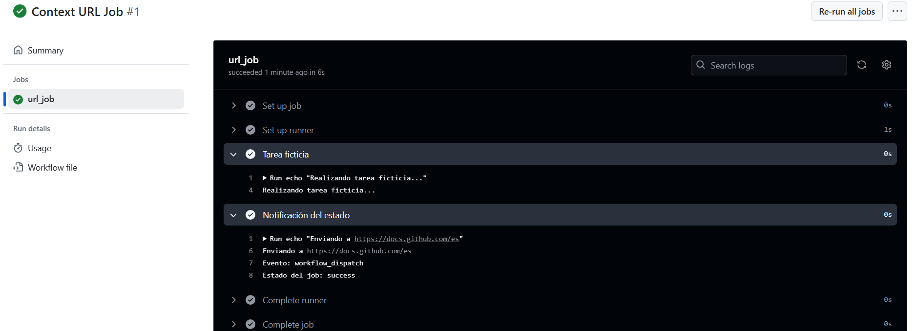

# Contexts - Ejercicio 3

## Configura un workflow que realice una tarea ficticia y luego envíe un mensaje de notificación a una URL (simulada con echo) usando el estado del job y el nombre del evento que lo desencadenó.


#

Utilizo los contextos ${{ github.event_name }} y ${{ job.status }} para el despliegue ficticio. 

## Workflow 

```yml
# Nombre del workflow
name: Context URL Job

# Evento para lanzar el Workflow manualmente
on:
  workflow_dispatch:

# Jobs a ejecutar
jobs:
  url_job:
    runs-on: labs-runner # Runner de Stemdo
    steps:
      - name: Tarea ficticia
        run: echo "Realizando tarea ficticia..."

      - name: Notificación del estado
        run: |
          echo "Enviando a https://docs.github.com/es"
          echo "Evento: ${{ github.event_name }}"
          echo "Estado del job: ${{ job.status }}"
```

## Comprobación 




