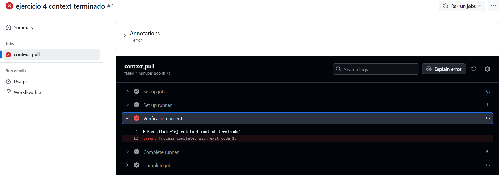
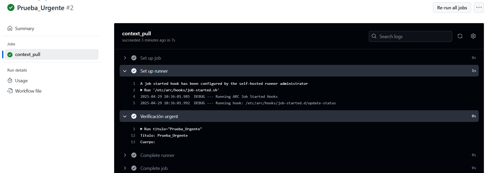
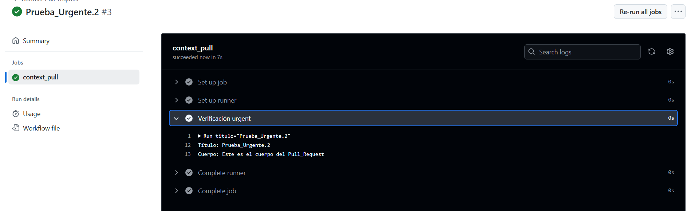

# Contexts - Ejercicio 4

## Configura un workflow que se ejecute cuando se abra una pull_request. El workflow debería verificar si el título del pull request contiene una palabra clave específica (urgent). Si la palabra se encuentra en el título, imprime el título y cuerpo de la PR, si la palabra no se encuentra en el título, haz que la ejecución falle.


#
Se ejecuta solo al realizar un pull_request, en caso de que esto no ocurra el workflow no se lanzará. La segunda condición es que el pull_request tenga "urgent" en el título (mayúsculas o minúsculas), en caso de no ocurrir falla. 


## Workflow 
```yml
# Nombre del workflow
name: Context Pull_request

on:
  pull_request:
    types: [opened]  # El workflow solo se ejecuta cuando se crea un nuevo Pull Request

# Jobs a ejecutar
jobs:
  context_pull:
    runs-on: labs-runner # Runner de Stemdo
    steps:
      - name: Verificación urgent
        # Condición, si existe un título con el termino "urgent" te imprime el título completo y su cuerpo. Si no, la ejecución falla. 
        run: |
            titulo="${{ github.event.pull_request.title }}"
            titulo_min=$(echo "$titulo" | tr '[:upper:]' '[:lower:]')

            if [[ "$titulo_min" =~ urgent ]]; then
                echo "Título: $titulo"
                echo "Cuerpo: ${{ github.event.pull_request.body }}"
            else
                exit 1
            fi


```

## Fallo 



## Correcto funcionamiento 


