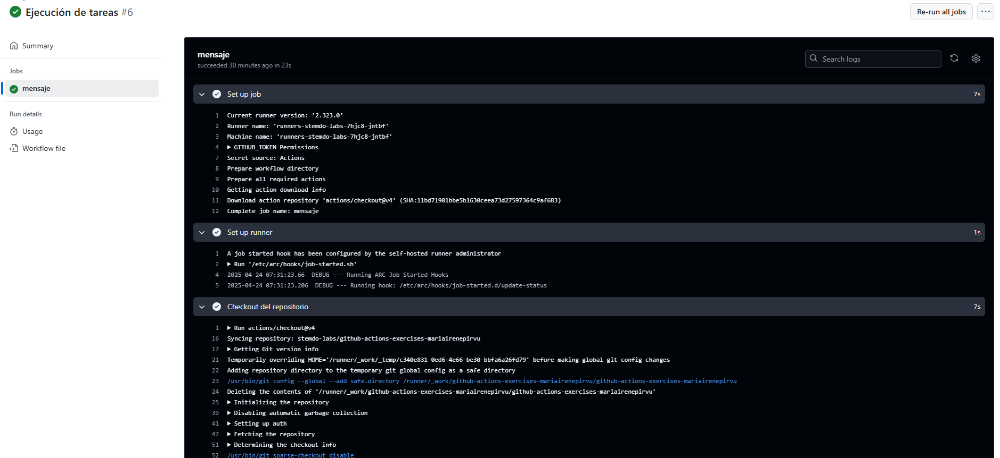
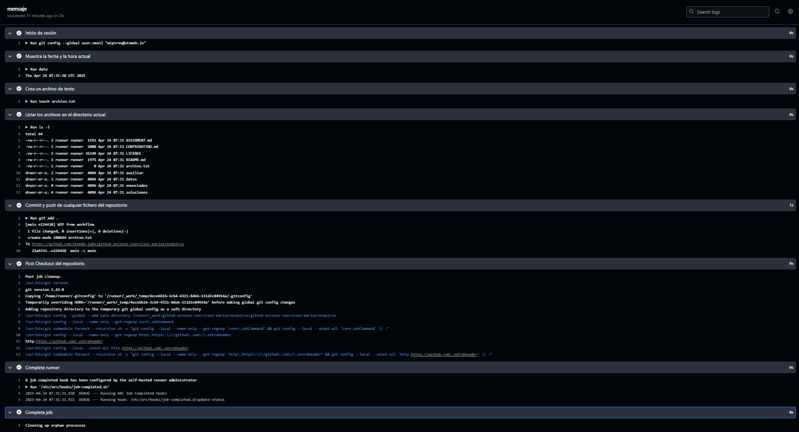

# Jobs y Steps - Ejercicio 1

## Configura un workflow (workflow_dispatch) con un solo job que haga las siguientes tareas:

- Mostrar la fecha y hora actual.
- Crear un archivo de texto.
- Listar los archivos en el directorio actual.
- Hacer un commit y push de cualquier fichero en el repositorio.


#

 Este workflow está formado por un único job con varios steps. Además de los pasos del enunciado, también añado lo siguiente para que todo funcione correctamente:
* Uso la acción oficial checkout para poder acceder al contenido del repositorio dentro del runner.
* Configuro los datos de usuario Git para poder hacer commits.
* De forma predeterminada, los workflows solo tienen permisos de lectura, así que añado permisos de escritura para poder hacer push.
  
## Workflow

```yml
# Nombre del workflow
name: Ejecución de tareas 

# Evento para lanzar el Workflow manualmente
on:
  workflow_dispatch:

permissions:  # Permisos de escritura 
  contents: write

# Jobs a ejecutar
jobs:
  tareas:
    runs-on: labs-runner # Runner de Stemdo
    steps:
      - name: Checkout del repositorio # Acción oficial que clona el repositorio en el runner
        uses: actions/checkout@v4
      - name: Inicio de sesión # Datos de usuario para poder hacer el commit
        run: |
          git config --global user.email "mipirvu@stemdo.io"
          git config --global user.name "MªIrene"
      - name: Muestra la fecha y la hora actual
        run: date  # Comando que muestra la fecha y hora actual
      - name: Crea un archivo de texto 
        run: touch archivo.txt # Creación archivo de texto
      - name: Listar los archivos en el directorio actual 
        run: ls -l # Muestra los archivos de texto del directorio actual
      - name: Commit y push de cualquier fichero del repositorio
        run: |
          git add . 
          git commit -m "WIP from workflow" 
          git push 

```

## Comprobación 


