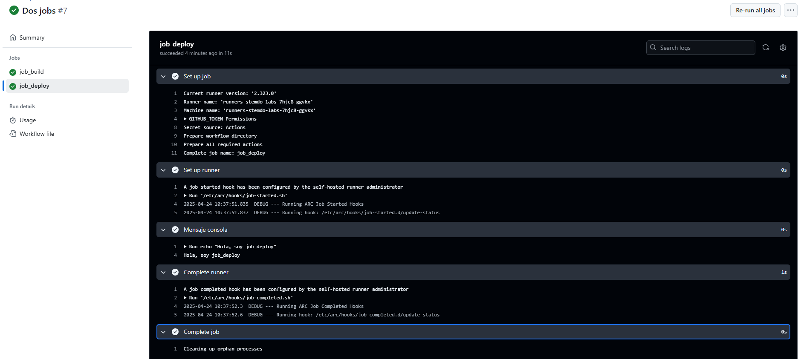

# Jobs y Steps - Ejercicio 2

## 1. Configura dos jobs en un único workflow: "build" y "deploy"
- En el job deploy imprime un mensaje por la consola.
- El job deploy debe depender del éxito del job build.
- Si el job "build" falla, el job "deploy" **no debe ejecutarse.**

#

Este ejercicio he decidido realizarlo un tanto diferente, igualmente siguiendo lo que pide el enunciado. En lugar de modificar el workflow para realizar las comprobaciones, he decicido añadir una pregunta y según la respuesta job_deploy se ejecuta o no. Esto se debe a que job_deploy depende de job_build (needs), si en job_build ocurre cualquier error job_deploy no se ejecuta. 

## Workflow

```yml
# Nombre del workflow
name: Dos jobs

# Evento para lanzar el Workflow manualmente
on:
  workflow_dispatch:
    inputs:
        opciones_build:
            description: '¿Deseas que job build tenga éxito?' 
            required: true
            default: 'Sí'
            type: choice
            options:
            - 'Sí'
            - 'No'

# Jobs a ejecutar
jobs:
    job_build:
        runs-on: labs-runner # Runner de Stemdo
        steps:
          - name: Script de éxito o fallo en job_build
            run: |
                if [ "${{ github.event.inputs.opciones_build }}" == "No" ]; then
                    echo "¡Error! Algo salió mal en el job build."
                    exit 1  # Simula un fallo real
                else
                    echo "¡El job build funciona correctamente!"
                    exit 0  # Éxito
                fi
    job_deploy:
        needs: job_build # Depende de job_build
        runs-on: labs-runner # Runner de Stemdo
        steps:
          - name: Mensaje consola   
            run: echo "Hola, soy job_deploy"

```

## Éxito 





## Fallo 


