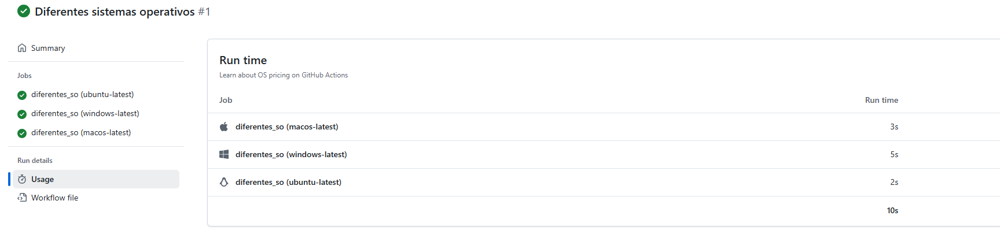
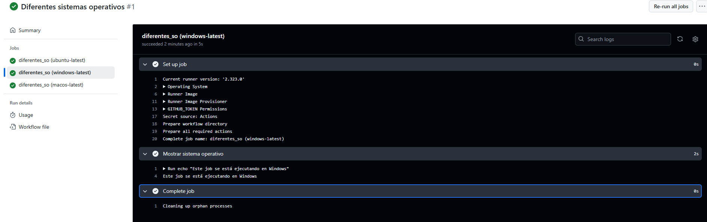

# Jobs y Steps - Ejercicio 3

## Configura un workflow que ejecute el mismo job en diferentes sistemas operativos

Este workflow utiliza una matriz (matrix) para ejecutar el mismo job en tres sistemas operativos diferentes. 

## Workflow

```yml
# Nombre del workflow
name: Diferentes sistemas operativos

# Evento para lanzar el Workflow manualmente
on:
  workflow_dispatch:

# Job a ejecutar en distintos sistemas operativos
jobs:
  diferentes_so:
    runs-on: ${{ matrix.os }}
    strategy:
      matrix:
        os: [ubuntu-latest, windows-latest, macos-latest]
    steps:
      - name: Mostrar sistema operativo
        run: echo "Este job se está ejecutando en ${{ runner.os }}"

```
## Comprobación 


