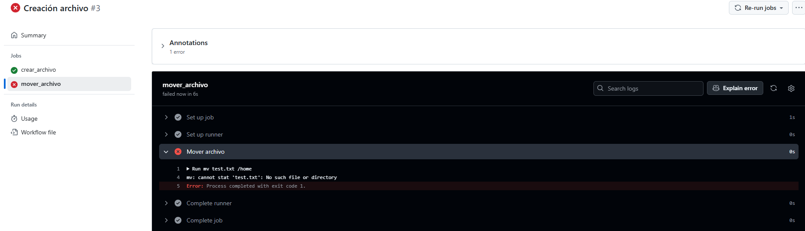

# Jobs - Ejercicio 4

## 1. Crea un job el cual cree un archivo .txt llamado "test"

## 2. Crea otro job que mueva el archivo creado anteriormente a otro directorio. ¿Qué es lo que ocurre?

### ¿Qué ocurre?
Lo que ocurre en este Workflow es que al tener dos jobs diferentes, cada uno se ejecuta en su propio espacio de trabajo de forma independiente.

## Workflow
```yml
# Nombre del workflow
name: Creación archivo 

# Evento para lanzar el Workflow manualmente
on:
  workflow_dispatch:

# Job a ejecutar en distintos sistemas operativos
jobs:
  crear_archivo:
    runs-on: labs-runner # Runner de Stemdo
    steps:
      - name: Creación de archivo 
        run: echo "Este es un archivo de prueba" > test.txt # Creación archivo
  mover_archivo:
    runs-on: labs-runner # Runner de Stemdo
    steps:
      - name: Mover archivo 
        run: mv test.txt /home # Mover archivo

```

## Comprobación 
