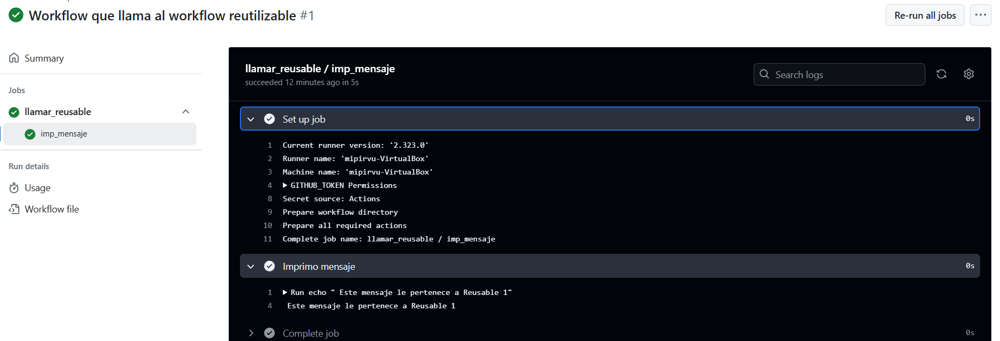

# Workflows reusables - Ejercicio 1

## Configura un workflow reutilizable que simplemente imprima un mensaje

## Luego, crea otro workflow que use ese workflow reutilizable


#
Necesito dos Workflows para esta práctica, el Workflow reutilizable (el que contiene la acción) y el Workflow que llama al reutilizable. 
A partir de este ejercicio empiezo a utilizar mi runner personal.


## Workflow Reutilizable 

```yml
# Nombre del workflow
name: Workflow reutilizable que imprime mensaje 

# Este workflow puede ser llamado por otros workflows
on:
  workflow_call:

# Jobs a ejecutar
jobs:
  imp_mensaje:
    runs-on: MIP  # Mi Runner
    steps:
      - name: Imprimo mensaje
        run: echo " Este mensaje le pertenece a Reusable 1"
  

  
```


## Workflow

```yml
# Nombre del workflow
name: Workflow que llama al workflow reutilizable 

# Evento para lanzar el Workflow manualmente
on:
  workflow_dispatch:

# Jobs a ejecutar
jobs:
  llamar_reusable:
    uses: ./.github/workflows/reusable_E1.yml 
  

```


## Comprobación 

