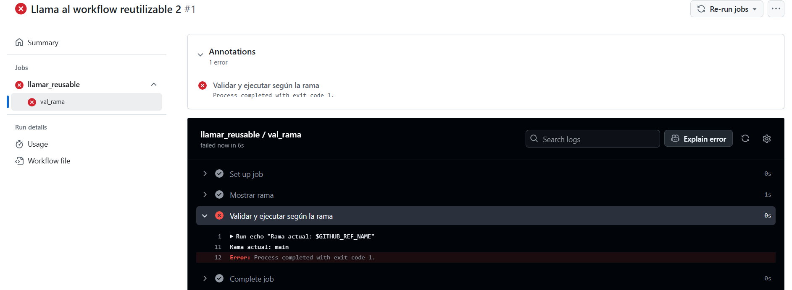
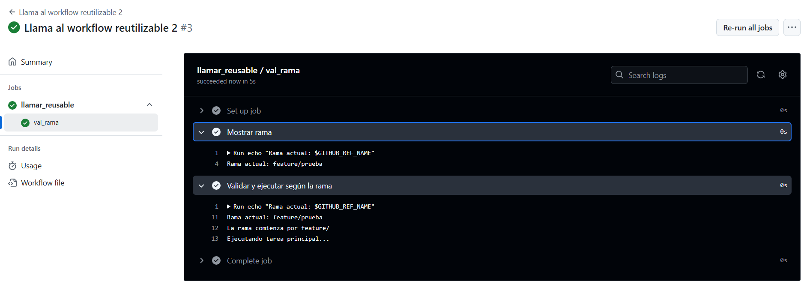

# Workflows reusables - Ejercicio 2

## Configura un workflow reutilizable que primero valide si el nombre de la rama con la que se ejecuta empieza con "feature/". Solo si la validación es exitosa, se ejecutará la tarea principal


#
Hago uso de "$GITHUB_REF_NAME" y de condiciones para poder validar si el nombre de la rama comienza por "feature/" o no. 


## Workflow Reutilizable 

```yml
# Nombre del workflow
name: Workflow reutilizable validación rama

# Este workflow puede ser llamado por otros workflows
on:
  workflow_call:

# Jobs a ejecutar
jobs:
  val_rama:
    runs-on: MIP  # Mi Runner
    steps:
      - name: Mostrar rama 
        run: |
          echo "Rama actual: $GITHUB_REF_NAME"

      - name: Validar y ejecutar según la rama
        run: |
          echo "Rama actual: $GITHUB_REF_NAME"
          if [[ "$GITHUB_REF_NAME" == feature/* ]]; then
            echo "La rama comienza por feature/"
            echo "Ejecutando tarea principal..."
          else
            exit 1
          fi
```


## Workflow

```yml
# Nombre del workflow
name: Llama al workflow reutilizable 2

# Evento para lanzar el Workflow manualmente
on:
  workflow_dispatch:

# Jobs a ejecutar
jobs:
  llamar_reusable:
    uses: ./.github/workflows/reusable_E2.yml 

```


## Fallo 



## Correcto 


