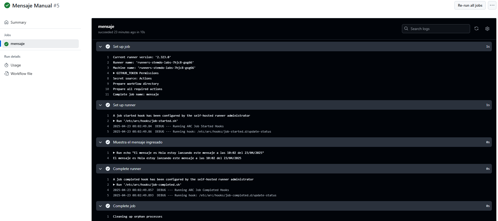

# Triggers (Dispatch) - Ejercicio 

## 1. Configura un workflow para que se ejecute manualmente usando el evento workflow_dispatch.

## 2. Define un input llamado _"message"_ que permita al usuario ingresar un mensaje personalizado.

## 3. El workflow debe ser capaz de imprimir ese mensaje.

Creo el workflow utilizando workflow_dispatch para que se lance solo cuando se desee desde github.  

## Workflow

```yml 
# Nombre del workflow
name: Mensaje Manual

# Evento para lanzar el Workflow manualmente
on:
  workflow_dispatch:
    inputs:  
      message:
        description: 'Ingresa un mensaje personalizado'  # Descripción del input que se muestra 
        required: true # Campo obligatorio

# Job a ejecutar
jobs:
  mensaje:
    runs-on: labs-runner # Runner de Stemdo
    steps:
      - name: Muestra el mensaje ingresado # Nombre que se mostrará en la ejecución
        run: echo "El mensaje es ${{ github.event.inputs.message }}"  # Comando que imprime el mensaje introducido 

```
## Comprobación 

