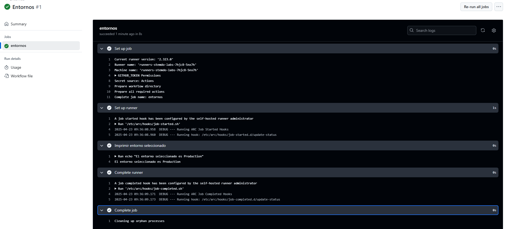

# Triggers (Dispatch) - Ejercicio 2

## 1. Configura un workflow para que se ejecute manualmente usando el evento workflow_dispatch.

## 2. Define un input llamado "_environment_" que permita seleccionar entre "_production_" y "_staging_".

## 3. Imprime el entorno seleccionado en la consola.

Para este ejercicio se requiere utilizar environment para seleccionar entre dos, para ello utilizo el tipo "choice".

## Workflow

```yml
# Nombre del workflow
name: Entornos

# Evento para lanzar el Workflow manualmente
on:
  workflow_dispatch:
    inputs:
      environment:
        description: 'Selecciona el entorno' # Descripción del input que se muestra 
        required: true # Campo obligatorio
        type: choice # Tipo de input para elegir entre varias opciones
        options:
          - Production 
          - Staging    

# Job a ejecutar
jobs:
  entornos:
    runs-on: labs-runner # Runner de Stemdo
    steps:
      - name: Imprimir entorno seleccionado # Nombre que se mostrará en la ejecución
        run: echo "El entorno seleccionado es ${{ inputs.environment }}" 
        # Comando que imprime el entorno elegido


```
## Comprobación 

