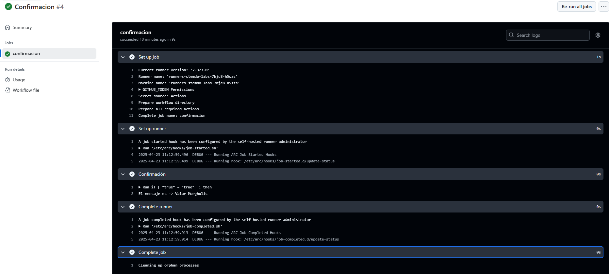

# Triggers (Dispatch) - Ejercicio 2

## 1. Configura un workflow para que se ejecute manualmente usando el evento workflow_dispatch.

## 2. Define un input llamado _"confirm"_ que requiera una _confirmación_ ("true" o "false").

## 3. Imprime un mensaje, dependiendo de si la confirmación es positiva o negativa.

Para este ejercicio utilizo choice como en el anterior. Además para devolver el mensaje debo utilizar un script. Para que lo interprete como script debo añadir "|", sin este, yml no es capaz de interpretar el script. 

## Workflow

```yml
# Nombre del workflow
name: Confirmacion

# Evento para lanzar el Workflow de forma manual 
on:
  workflow_dispatch:
    inputs:
      confirm:
        description: '¿Quieres ver el mensaje? (true o false)' # Pregunta con respuesta true o false
        required: true # Campo obligatorio
        type: choice # Tipo de input para listar opciones   
        options:
            - true 
            - false

# Job a ejecutar 
jobs:
  confirmacion:
    runs-on: labs-runner # Runner de Stemdo
    steps:
      - name: Confirmación # Nombre de la accion 
        run: | # Script Bash. Comprueba si se pasa True o False y lanza el mensaje. 
          if [ "${{ inputs.confirm }}" = "true" ]; then 
            echo "El mensaje es -> Valar Morghulis"
          else 
            echo " "
          fi
```
## Comprobación 

