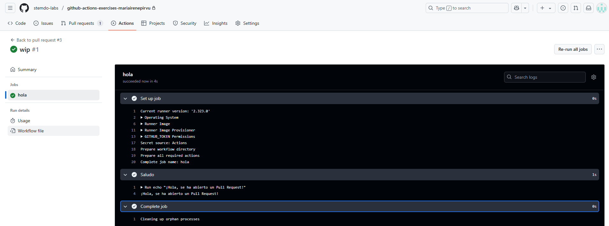

# Triggers - Ejercicio 1

## Configura un workflow para que se ejecute cuando se abre un Pull Request

Al hacer un Pull Request se debe ejecutar el siguiente workflow que muestra un saludo. 

## Workflow

```yml
# Nombre del workflow
name: Mensaje al hacer un Pull Request

# Evento que lanza el workflow automáticamente cuando se abre un Pull Request
on:
  pull_request:
    types: [opened]  # El workflow solo se ejecuta cuando se crea un nuevo Pull Request

# Job a ejecutar
jobs:
  hola:
    runs-on: ubuntu-latest  # Utiliza el runner por defecto

    steps:
      - name: Saludo  # Nombre en GitHub Actions
        run: echo "¡Hola, se ha abierto un Pull Request!"  
        # Imprime saludo 

```

## Comprobación 

