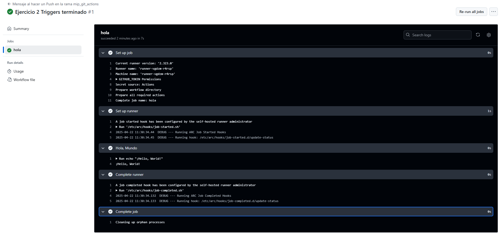

# Triggers - Ejercicio 2

## Configura un workflow para que se ejecute cuando se haga un push en la rama develop y simplemente imprima "Hello, World!" en la consola.

Configuro el Workflow que se ejecuta al realiza un push en la rama "mip_git_actions", en lugar de crear la rama "develop" utilicé la mía personal. 

## Workflow

```yml
# Nombre del workflow
name: Mensaje al hacer un Push en la rama mip_git_actions

# Evento que lanza el workflow automáticamente al hacer push en una rama específica
on:
  push:
    branches:
      - mip_git_actions  # Solo se ejecuta si el push se da en la rama "mip_git_actions"

# Job a ejecutar
jobs:
  hola:
    runs-on: labs-runner  # Runner de Stemdo

    steps:
      - name: Hola, Mundo  # Nombre del paso que se verá en GitHub Actions
        run: echo "¡Hello, World!"  
        # Imprime un saludo

```
## Comprobación 

