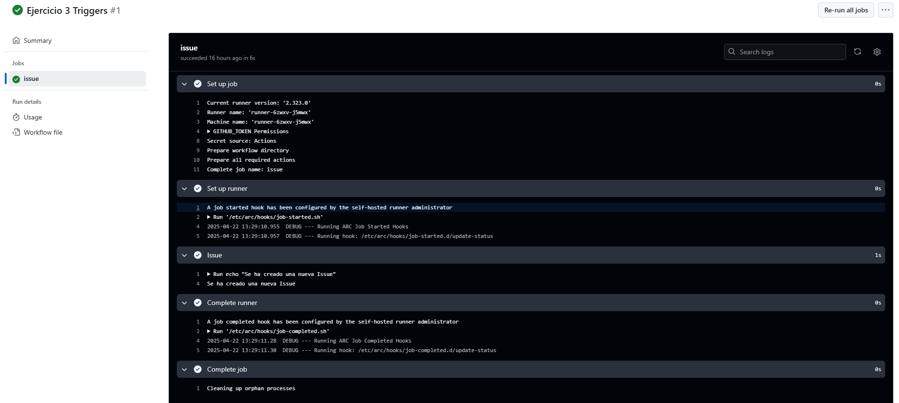

# Triggers - Ejercicio 3

## Configura un workflow para que se ejecute cuando se cree una nueva Issue
Configuro el Workflow para que se ejecute al crear una nueva Issue, para comprobarlo me dirijo a la ventana Issue y creo una nueva. 

## Workflow

```yml
# Nombre del workflow
name: Nueva Issue 

# Evento que lanza el workflow automáticamente
on:
  issues:
    types:
      - opened  # Solo se ejecuta cuando la issue se crea 

# Job a ejecutar
jobs:
  issue:
    runs-on: labs-runner  # Runner de Stemdo

    steps:
      - name: Issue  # Nombre del paso en GitHub Actions
        run: echo "Se ha creado una nueva Issue"
        # Muestra un mensaje indicando que se ha creado una issue
  
```
## Comprobación 

