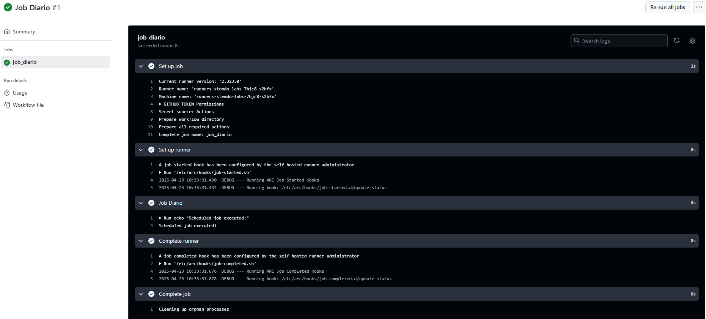

# Triggers - Ejercicio 4

## Configura un workflow para que se ejecute todos los días a las 12:00 UTC y que imprima "Scheduled job executed!" en la consola

Lo configuré a las 10:00 UTC para que se ejecutara a las 12 y así tener algo de margen en caso de tener que solucionarlo. Igualmente no se ejecutó a las 12 en punto, se ejecutó a las 12:30. 

## Workflow

```yml
# Nombre del workflow
name: Job Diario  

# Evento que lanza el workflow automáticamente 
on:
  schedule:
    - cron: '0 10 * * *'  # Ejecuta el workflow todos los días a las 10:00 AM (hora UTC)

# Job a ejecutar
jobs:
  job_diario:
    runs-on: labs-runner  # Runner de Stemdo

    steps:
      - name: Job Diario  # Nombre del paso que se mostrará en GitHub Actions
        run: echo "Scheduled job executed!" 
        # Imprime el mensaje 

```

## Comprobación 

