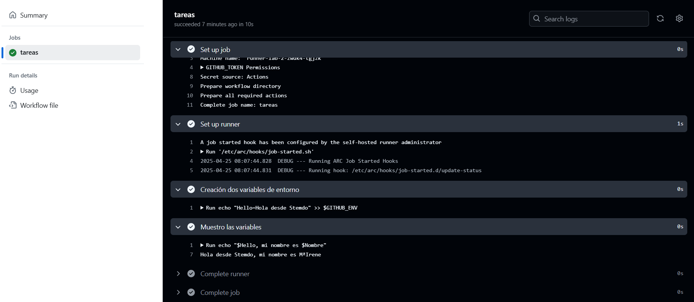

# Variables y Outputs - Ejercicio 1

## Configura un workflow con un solo job que haga las siguientes tareas

- En el primer step, define dos variables de entorno.
- En el segundo step, usa estas variables para ejecutar un comando o script.


## Workflow

Creo las variables y las muestro por pantalla.
```yml
# Nombre del workflow
name: Dos variables de entorno 

# Evento para lanzar el Workflow manualmente
on:
  workflow_dispatch:

jobs:
  tareas:
    runs-on: labs-runner # Runner de Stemdo
    steps:
      - name: Creación dos variables de entorno
        run: | 
            echo "Hello=Hola desde Stemdo" >> $GITHUB_ENV
            echo "Nombre=MªIrene" >> $GITHUB_ENV
      - name: Muestro las variables 
        run: 
            echo "$Hello, mi nombre es $Nombre"
```

## Comprobación 

