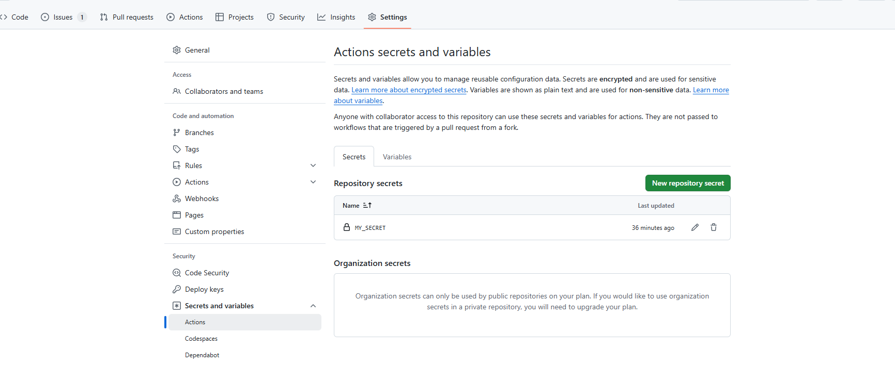
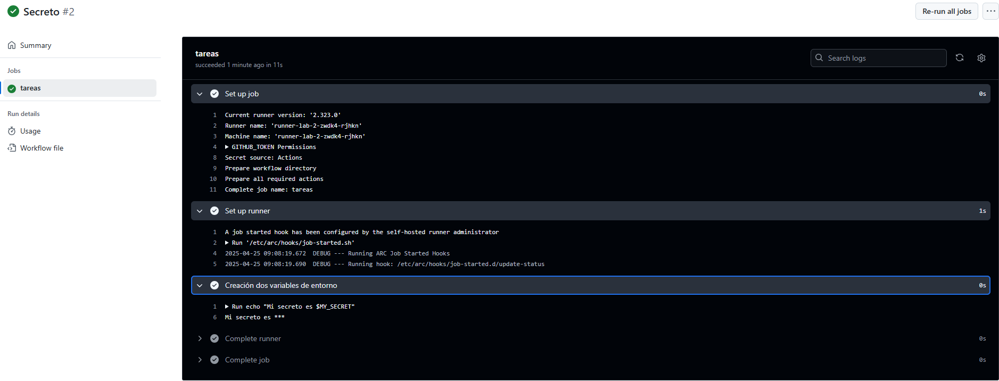

# Variables y Outputs - Ejercicio 2

## Configura un job que use un secreto definido en el repositorio (por ejemplo, MY_SECRET) y lo use en un comando.

Creo el secreto en GitHub dentro de **Settings > Secrets and Variables > Actions > New repository secret**




## Workflow

```yml
# Nombre del workflow
name: Secreto 

# Evento para lanzar el Workflow manualmente
on:
  workflow_dispatch:

jobs:
  secreto:
    runs-on: labs-runner # Runner de Stemdo
    steps:
      - name: Muestro el secreto 
        run: echo "Mi secreto es $MY_SECRET"
        env:
          MY_SECRET: ${{ secrets.MY_SECRET }}
```

## Comprobación 

