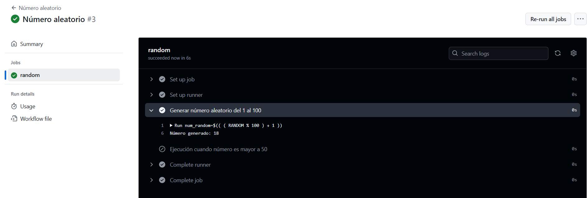
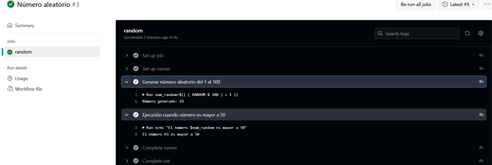

# Variables y Outputs - Ejercicio 3

## Configura un workflow siguiendo estos pasos:

- Define un step que genere un número aleatorio del 1 al 100.

- En el segundo step, utiliza un condicional para ejecutar comandos solo si el número es mayor a 50.


#
He configurado el workflow para que genere números randome cada vez que se ejecute. En el caso de que el número sea superior a 50, se ejecuta un echo con un mensaje, en caso contrario el step2 no se ejecuta. 


## Workflow

```yml
# Nombre del workflow
name: Número aleatorio 

# Evento para lanzar el Workflow manualmente
on:
  workflow_dispatch:

jobs:
  random:
    runs-on: labs-runner # Runner de Stemdo
    steps:
      - name: Generar número aleatorio del 1 al 100
      # Genero el número aleatorio, lo muestro por pantalla y lo introduzco en una variable de entorno para utilizarlo posteriormente.
        run: |
          num_random=$(( ( RANDOM % 100 ) + 1 )) 
          echo "Número generado: $num_random"
          echo "num_random=$num_random" >> $GITHUB_ENV 
      # Condicional if. Solo se ejecuta el echo si el número aleatorio es mayor a 50.
      - name: Ejecución cuando número es mayor a 50
        if: ${{ env.num_random > 50 }} 
        run: echo "El número $num_random es mayor a 50"
```
#### Número inferior a 50


#### Número superior a 50
