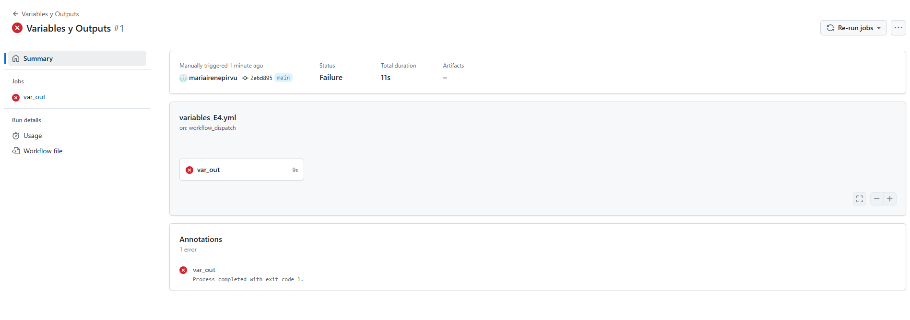
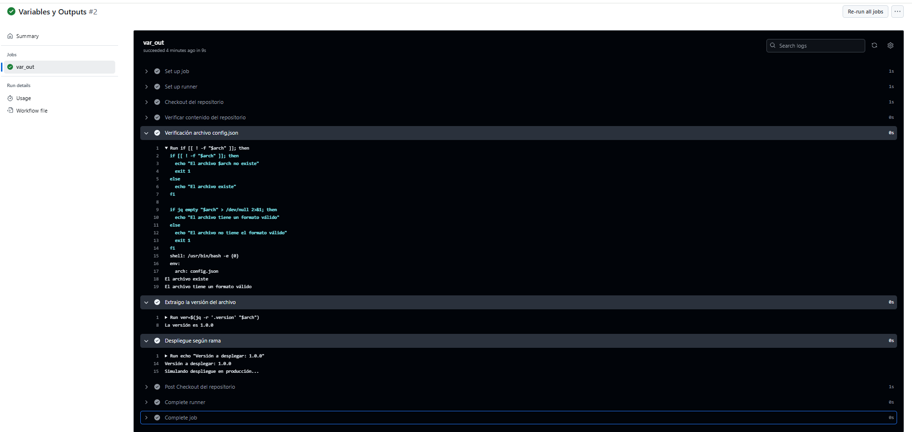
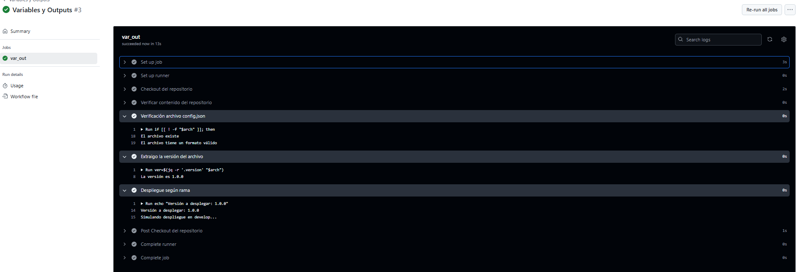

# Variables y Outputs - Ejercicio 4

## Configura un workflow que valide un archivo de configuración (config.json) y realice un despliegue condicional a develop o producción basado en la rama desde la cual se hace el push.

### Pasos:

- Verificar que el archivo config.json exista y que tenga el formato JSON válido.
- Extraer un valor específico del archivo config.json (por ejemplo, la versión de la aplicación) y utilizarlo como un output.
- Si el push se hace en la rama main, el workflow debería simular un despliegue de la aplicación en producción.
- Si el push se hace en una rama develop, el workflow debería simular un despliegue de la aplicación en develop.
- Si el archivo config.json no es válido, el workflow debería fallar y detenerse sin realizar el despliegue.

# 
Realizo el workflow según el enunciado. Para las comprobaciones tengo en cuneta los siguientes puntos:
* Creo el archivo (después de comprobar el fallo) manualmente.
* Utilizo mi rama personal (mip_git_actions) y no la rama develop.
* Realizo el push manualmente.

## Workflow
```yml
# Nombre del workflow
name: Variables y Outputs 

# Evento para lanzar el Workflow manualmente
on:
  workflow_dispatch:

env:
  arch: config.json  # Nombre del archivo como variable de entorno

# Jobs a ejecutar
jobs:
  var_out:
    runs-on: labs-runner # Runner de Stemdo
    steps:
      - name: Checkout del repositorio # Acción oficial que clona el repositorio en el runner
        uses: actions/checkout@v4

        # Comprobación existencia del archivo y formato válido con jq.
      - name: Verificación archivo config.json
        run: |
          if [[ ! -f "$arch" ]]; then
            echo "El archivo $arch no existe"
            exit 1
          else 
            echo "El archivo existe"
          fi
          if jq empty "$arch" > /dev/null 2>&1; then 
            echo "El archivo tiene un formato válido" 
          else 
            echo "El archivo no tiene el formato válido"
            exit 1
          fi
        # Muestro por pantalla la versión del archivo según config.json
      - name: Extraigo la versión del archivo
        id: version_app
        run: |
          ver=$(jq -r '.version' "$arch")
          echo "La versión es $ver"
          echo "version=$ver" >> "$GITHUB_OUTPUT"
        # Simulación de despliegue según la rama en la que se realice el push. Variable GITHUB_REF para comprobar en que rama se hizo el push. 
      - name: Despliegue según rama
        run: |
          echo "Versión a desplegar: ${{ env.version }}"  # Usamos la variable de entorno 'version'

          if [[ "${GITHUB_REF}" == "refs/heads/main" ]]; then
            echo "Simulando despliegue en producción..."
          elif [[ "${GITHUB_REF}" == "refs/heads/mip_git_actions" ]]; then
            echo "Simulando despliegue en develop..."
          else
            echo "Tienes que seleccionar la rama main o la personal"
          fi


```

## Fallo 
Primero realicé una comprobación sin la existencia de ningún archivo json por lo tanto falló y no se realizó el despliegue. 


 
## Producción


## Develop
