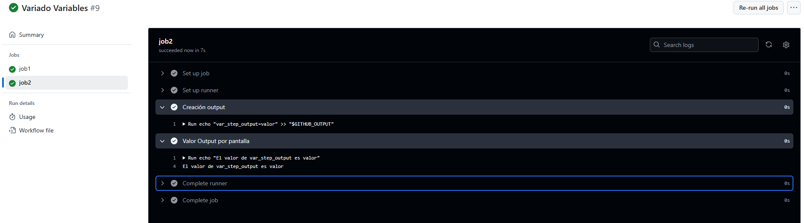
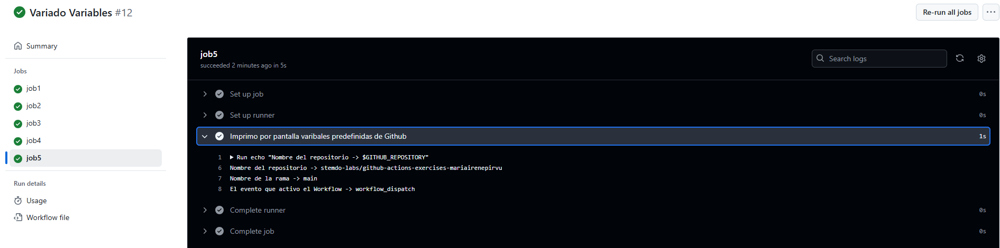
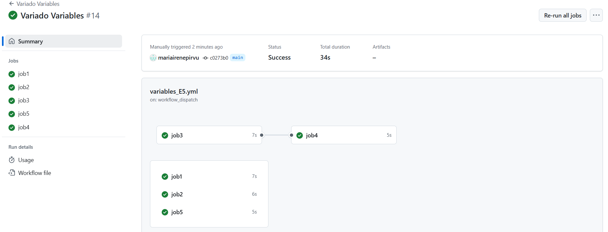

# Ejercicio 5

Variables entre pasos de un mismo job:

- Crea un job que:
  - Defina una variable local ``var1`` con valor 1 y la imprima.
  - Defina una variable ``var2`` usando el entorno de GitHub (``$GITHUB_ENV``) con valor 2.
  - Imprima el valor de ``var2`` en un paso diferente.

---
Compartir variables entre pasos usando outputs:

- Crea un job que:
  - Defina un output ``var_step_output`` con valor "valor".
  - Imprima el valor de ``var_step_output`` en un paso posterior.

---
Compartir variables entre jobs:

- Crea un job que:
  - Imprima el valor de ``var2`` y observa qué sucede.
  - Defina un output ``var3`` con valor 3 para compartir con otros jobs.

---
Imprimir variables entre jobs:

- Crea un job que dependa del anterior y:
  - Imprima el valor de ``var3`` definido en el job anterior.

---
Usar variables predefinidas de GitHub:

- Crea un job que imprima las siguientes variables predefinidas por GitHub:
  - Nombre del ``repositorio``.
  - Nombre de la ``rama``.
  - Nombre del ``evento`` que activó el workflow.


# 
En este ejercicio realizo paso a paso las indicaciones del enunciado.

## Workflow

```yml
# Nombre del workflow
name: Variado Variables

# Evento para lanzar el Workflow manualmente
on:
  workflow_dispatch:

# Jobs a ejecutar
jobs:
  job1:
    runs-on: labs-runner # Runner de Stemdo
    steps:
      - name: Variable local var1
        run: |
          var1=1
          echo "El valor de var1 es $var1"
      - name: Variable entorno var2
        run: echo "var2=2" >> "$GITHUB_ENV"
      - name: Valor por pantalla var2
        run: echo "El valor de var2 es ${{ env.var2 }}"

  job2:
    runs-on: labs-runner # Runner de Stemdo
    steps:
      - name: Creación output
        id: var_job2
        run: echo "var_step_output=valor" >> "$GITHUB_OUTPUT"
      - name: Valor Output por pantalla 
        run: echo "El valor de var_step_output es ${{ steps.var_job2.outputs.var_step_output }}"
  job3:
    runs-on: labs-runner # Runner de Stemdo
    outputs:
        var3: ${{ steps.var_job3.outputs.var3 }}
    steps:
      - name: Valor var2 por pantalla # No funciona. 
        run: echo "El valor de var2 es ${{ env.var2 }}"
      - name: Declaramos Output var3
        id: var_job3 
        run: echo "var3=3" >> "$GITHUB_OUTPUT"
  job4:
    runs-on: labs-runner # Runner de Stemdo
    needs: job3 # job4 depende de job3 
    steps:
      - name: Valor Output var3 por pantalla 
        run: echo "El valor de var3 es ${{ needs.job3.outputs.var3 }}"
  job5:
    runs-on: labs-runner # Runner de Stemdo
    steps:
      - name: Imprimo por pantalla variables predefinidas de Github
        run: |
          echo "Nombre del repositorio -> $GITHUB_REPOSITORY"
          echo "Nombre de la rama -> $GITHUB_REF_NAME"
          echo "El evento que activo el Workflow -> $GITHUB_EVENT_NAME"
    

```

## Job1


## Job2



## Job3
El valor de var2 no se muestra ya que es una variable de entorno que está disponible dentro del mismo job, incluidos sus diferentes pasos. No es accesible en otros jobs. 


## Job4


## Job5



## General 

