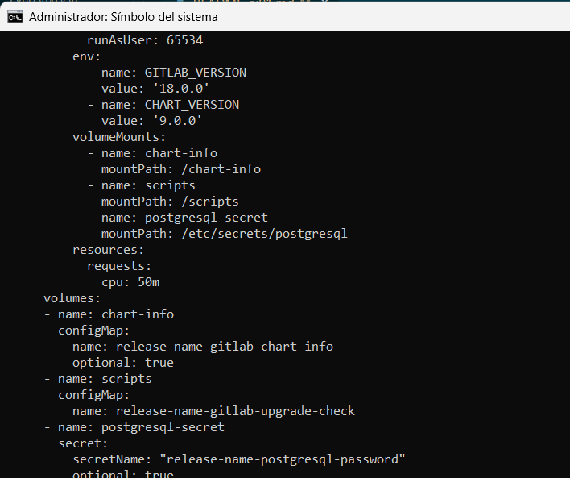

# **Ejercicio 01: Explorando Helm Charts en Artifact Hub**

## **Parte 1: Información Principal del Chart**

1. **Nombre del Chart y Mantenedor**  
   - ¿Cuál es el nombre del *chart* y quién es el mantenedor?
  <br> 
  El nombre del chart es "gitlab" y el mantenedor "GitLab Inc.". 

    
    

1. **Descripción del Chart**  
   - ¿Cuál es la descripción general del *chart*? ¿Para qué sirve esta aplicación o servicio?
  <br>
  Su descripción es: "GitLab is the most comprehensive AI-powered DevSecOps Platform.". 
  GitLab es una plataforma DevSecOps que implementa inteligencia artificial. Esta permite gestionar aplicaciones, CI/CD, seguridad de software...
  <br> <br> La descripción la obtuve de la página oficial ya que en helm/gitlab no encontré suficiente información. 
    


3. **Versión del Chart**  
   - ¿Cuál es la versión más reciente del *chart* disponible?
  <br> La versión más reciente del chart es **9.0.0 (15 Mayo, 2025)**.

1. **Versiones de Aplicaciones Soportadas**  
   - ¿Qué versiones de la aplicación soporta este *chart* (es decir, la versión de la aplicación subyacente)?
  <br> Soporta la versión v18.0.0 de la aplicación. 

    

---

## **Parte 2: Sección de Instalación**

5. **Comandos de Instalación**  
   - ¿Cuál es el comando principal para instalar este *chart* utilizando *Helm*?
  <br> El comando de instalación es: **helm install my-gitlab gitlab/gitlab --version 9.0.0**

6. **Repositorio del Chart**  
   - ¿En qué repositorio se encuentra alojado este *chart*? Proporciona la URL del repositorio.
  <br> Se encuentra alojado en "http://charts.gitlab.io/". 


7. **Versión de Helm requerida**  
   - ¿Cuál es la versión mínima de *Helm* que se necesita para instalar este *chart*?
  <br> Mínimo la versión 2 de Helm.

    
---

## **Parte 3: Valores Predeterminados (Default Values)**

8. **Archivo de Valores Predeterminados**  
   - ¿Qué opciones de configuración aparecen en el archivo de valores predeterminados (`values.yaml`)? Menciona al menos 5 configuraciones importantes.
  <br> 
     * Versión de GitLab -> **global.gitlabVersion**
     * Prevención de ataques XSS y Data injection -> <br> **contentSecurityPolicy: <br> enabled: false <br> report_only: true**
      * Backup remoto -><br> **backups:
       <br> bucket: gitlab-backups
      <br> tmpBucket: tmp**
      * Monitorización desactivada -> <br> **monitoring: <br>
    enabled: false**
      * Tiempo máximo en segundos de los workers antes de acabar una solicitud -> <br> **webservice: <br>
  workerTimeout: 60**


1. **Configuración de Recursos**  
   - ¿Qué valores predeterminados existen para la configuración de recursos (CPU, memoria, etc.)?
  
  **upgradeCheck**
  ```yaml
  resources:
    requests:
      cpu: 50m
  ```
  **controller**
  ```yaml
    resources:
      requests:
        cpu: 100m
        memory: 100Mi
  ```
  **defaultBackend**
  ```yaml
    resources:
      requests:
        cpu: 5m
        memory: 5Mi
  ```
  **shared-secrets**
  ```yaml
  resources:
    requests:
      cpu: 50m
  ```


  

---

## **Parte 4: Plantillas (Templates)**

10. **Plantillas del Chart**  
    - ¿Cuántas plantillas (`templates`) tiene este *chart*? ¿Cuáles son los archivos de plantilla más relevantes?
  <br> Tiene **59 plantillas**.
  <br> 
  Los más relevantes son:
      * application.yaml
      * chart-infor.yaml
      * initdb-configmap.yaml
      * shared-secrets/configmap.yaml
      * shared-secrets/job.yaml
      * shared-secrets/rbac-config.yaml
      * upgrade_check_hook.yaml 

1.  **Funcionalidad de Plantillas**  
    - Elige una plantilla del *chart* y describe su funcionalidad brevemente. ¿Qué parte del manifiesto de Kubernetes genera?
    <br> Elegí la plantilla **char-info.yaml**

    ```yaml
    apiVersion: v1
    kind: ConfigMap
    metadata:
      name: {{ template "fullname" . }}-chart-info
      namespace: {{ $.Release.Namespace }}
      labels:
        {{- include "gitlab.standardLabels" . | nindent 4 }}
        {{- include "gitlab.commonLabels" . | nindent 4 }}
    data:
      gitlabVersion: "{{ coalesce .Values.global.gitlabVersion .Chart.AppVersion }}"
      gitlabChartVersion: "{{ .Chart.Version }}"
    ```
    Esta crea un ConfigMap que guarda la versión de GitLab y la versión del chart. 
    Genera un recurso ConfigMap de Kubernetes con metadata y data. 

  
---

## **Parte 5: Esquema de Valores (Values Schema)**

12. **Validación de Esquema de Valores**  
    - ¿El *chart* tiene un esquema de valores (`values schema`) definido? Si es así, ¿qué propósito cumple y cómo ayuda a la validación de los valores proporcionados al instalar el *chart*?
  <db>

      El chart que he escogido no tiene **values schema** por lo que voy a seleccionar otro chart solo para este apartado y para el siguiente. 
      Seleccioné datadog, el propósito de **values schema** se encarga de validar los datos que el usuario proporciona. 
      Esto ayuda a prevenir errores de configuración. 

13. **Campos Obligatorios del Esquema**  
    - ¿Cuáles son algunos de los campos obligatorios en el esquema de valores? Menciona al menos 3 y describe su propósito.
     <db>
      * **- name** -> TYPE: string
      Nombre del recurso.
      * **- key** -> TYPE: string
      Clave asociada.
      * **operator:** -> TYPE: string
        ```
        Enum:
        In
        NotIn
        Exists
        DoesNotExist
        ```
        Indica la operación lógica permitiendo ciertos valora, los acotados según "Enum".
      * **value** -> TYPE: string
        Valor asociado a la clave, se utiliza solo en condiciones (las declaradas en operator). 
  
   

---

## **Parte 6: Preguntas de Personalización y Comparación**

14. **Personalización del Chart**  
    - Si quisieras personalizar la instalación del *chart* (por ejemplo, cambiar el puerto de la aplicación o modificar los recursos asignados), ¿qué pasos seguirías para hacerlo? ¿Qué archivos o secciones de la documentación consultarías?
  
      <db>Crearía un nuevo yaml para los valores que quisiera modificar y al instalar la aplicación añadiría al comando "-f values2.yaml". Consultaría los valores predeterminados y modificaría en base a estos. 
      
      <db> Consultaría la siguiente documentación:
          
      *  Documentación oficial de GitLab -> https://about.gitlab.com/es/
      * Archivo values.yaml 
      * Repositorio del chart -> https://gitlab.com/gitlab-org/charts/gitlab

15. **Comparación entre Charts**  
    - Busca otro *chart* similar al que seleccionaste inicialmente. ¿Qué diferencias observas en términos de configuraciones predeterminadas, plantillas o valores entre ambos *charts*?

      <db> He seleccionado **Gitea**, al compararlo con **GitLab** presenta las asiguientes diferencias:
      * Más ligero
      * Más sencillo
      * Menos templates 
      * Ejecución con pocos recursos, 512MB a 1GB.
      * Más vulnerabilidades
      * Su documentación de ArtifactHUB es mejor que la de GitLab 

---

### Parte 7: Uso de Helm Template

16. **Generación de Manifiestos**  
   - Utiliza el comando `helm template <nombre-chart> [opciones]` para generar los manifiestos de Kubernetes sin instalarlos. Explica cómo puedes ver el archivo antes de lanzarlo.  

      ```cmd
        helm template gitlab/gitlab --set certmanager-issuer.email=mipirvu@stemdo.io
        ```
     Voy a desglosar el comando:

        * helm template -> Genera los manifiestos sin instalar
        * gitlab-gitlab -> Nombre del chart 
        * --set cetmanager-issuer.email -> Valor obligatorio, si no lo asigno me da error el comando. 

El comando **helm template** muestra todos los archivos YAML que se aplicarían al lanzarlo.

  