# **Ejercicio 02: Desplegando Nginx en Kubernetes con Helm y gestionando versiones**


## **Parte 1: Desplegar el chart de Nginx utilizando Helm**

1. **Inicia tu entorno de Kubernetes con Minikube**
   - Inicio Minikube
     ```bash
     minikube start
     ```
     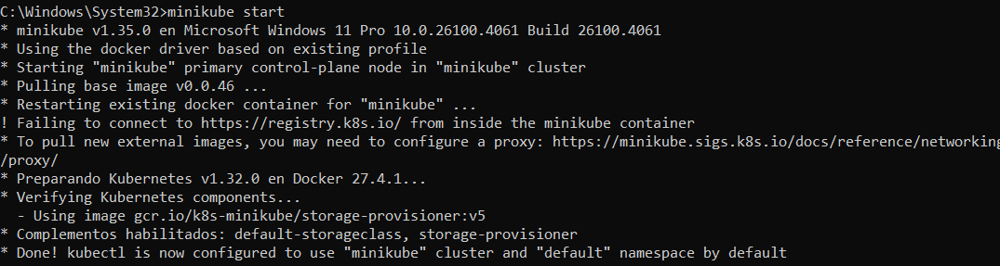
   - Compruebo su estado y funcionamiento
     ```bash
     kubectl get nodes
     ```
     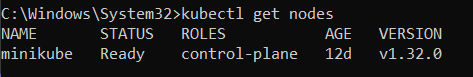

2. **Agrega el repositorio oficial de charts de Bitnami**
   - Agrego el repositorio de charts de Bitnami
     ```bash
     helm repo add bitnami https://charts.bitnami.com/bitnami
     ```
   - Comprobación 
     ```bash
     helm repo list
     ```

     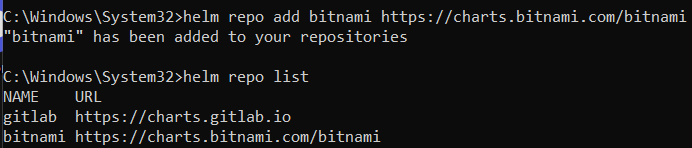

3. **Actualiza los repositorios de Helm**
   - Actualizo a la versión más reciente
     ```bash
     helm repo update
     ```
     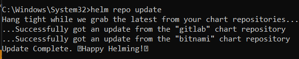

4. **Desplegar el chart de Nginx**
   - Despliego Nginx en mi cluster de Kubernetes con el chart de Bitnami. 
   - **helm install <nombre-release> bitnami/nginx** -> nombre-release es el nombre que le doy a la instalación.
     ```bash
     helm install nginx-mip-release bitnami/nginx
     ```
     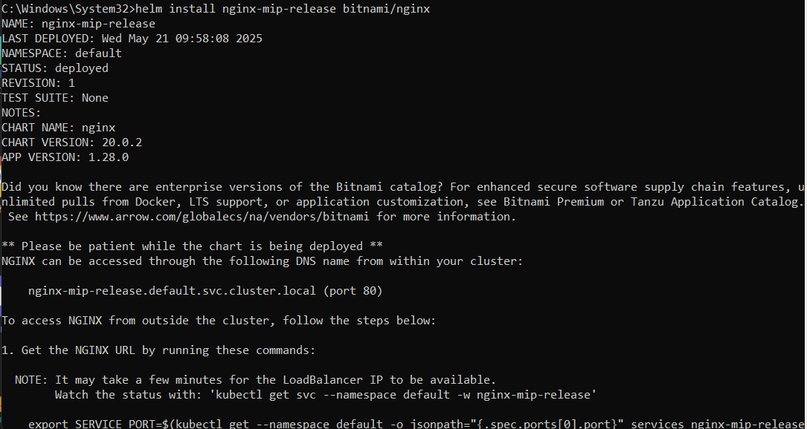


5. **Verificar la instalación**
   - Una vez finalizada la instalación compruebo su correcto funcionamiento.
     ```bash
     kubectl get pods
     ```
     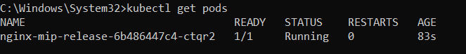

6. **Acceso a la aplicación**
   - Obtengo información sobre cómo acceder a Nginx.
     ```bash
     helm status nginx-mip-release
     ```
     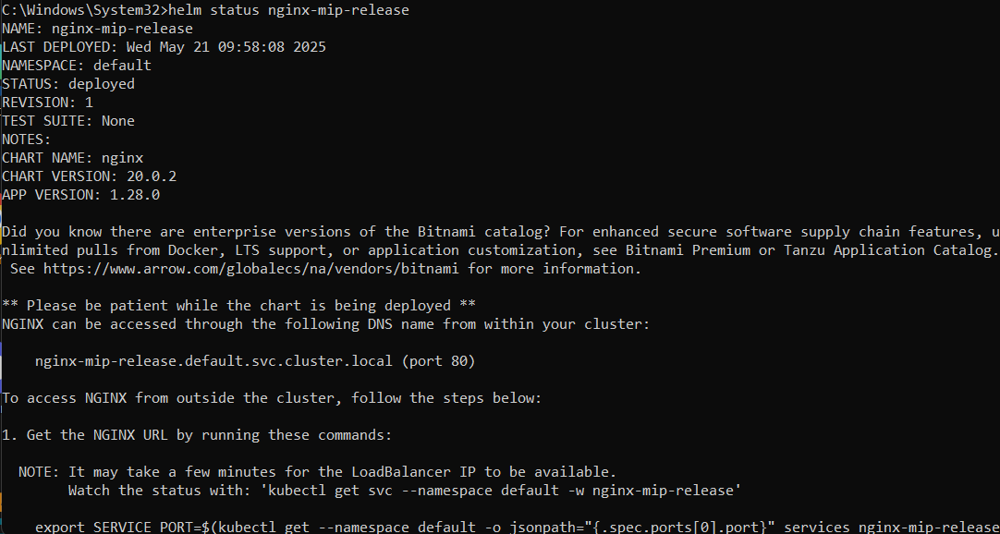

   - Accedo a la aplicación desde el navegador. 
     ```bash
     minikube service nginx-mip-release
     ```
    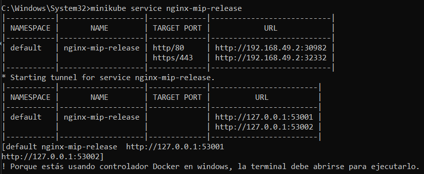
    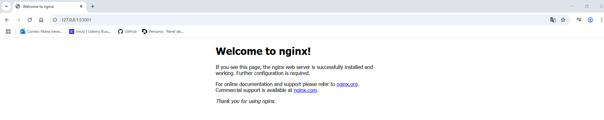

---

## **Parte 2: Gestionar releases y explorar comandos de Helm**

1. **Verificar el estado de tu release**  
   Exploro y gestiono mi release
   
   - **Listar las releases instaladas:** Muestra las releases instaladas 
     ```bash
     helm list
     ```
     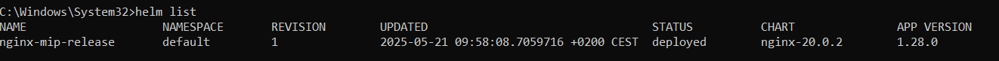

   - **Ver el estado de tu release:**  Muestra la información de una release en concreto; Nombre, despliegue, estado, sus notas ... 
     ```bash
     helm status nginx-mip-release
     ```
     
   - **Ver el manifiesto generado por Helm:** Muestra el manifesto del release. Este describe como debe funcionar el release, que es lo que se crea, su configuración.
     ```bash
     helm get manifest nginx-mip-release
     ```
     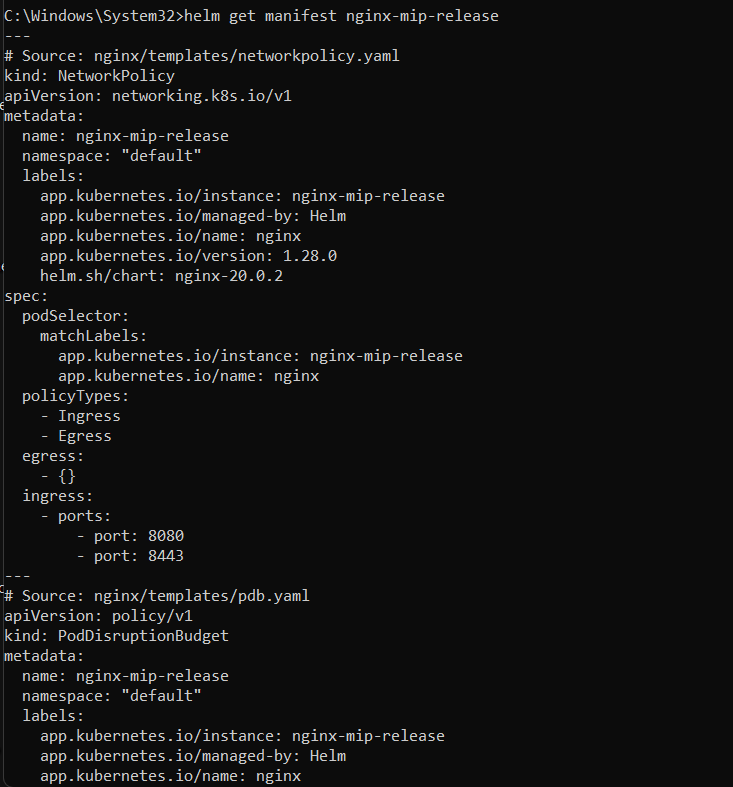
   - **Ver las notas de instalación:** Muestra las notas, una descripción del chart hecha para los desarrolladores. 
     ```bash
     helm get notes nginx-mip-release
     ```
     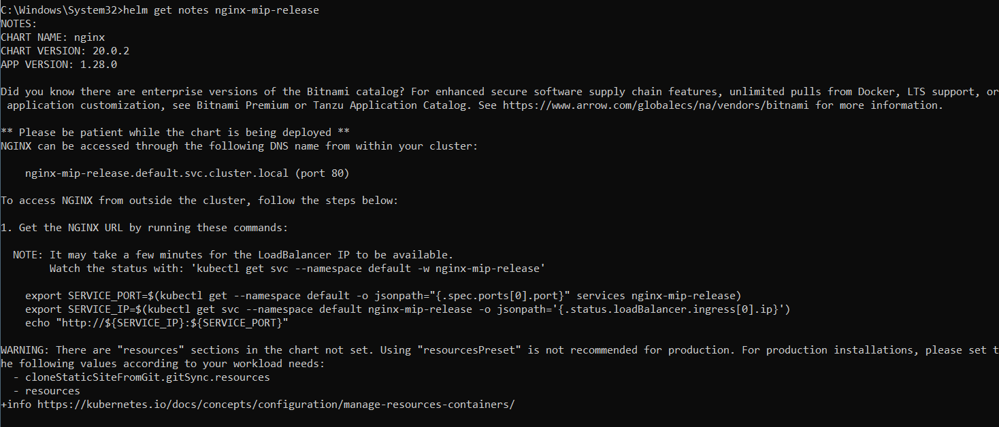

---

## **Parte 3: Realizar cambios en la configuración del chart (Upgrade)**

2. **Realiza un upgrade del chart**
   - Cambio el tipo de servicio a **NodePort** y selecciono otro puerto. Lo pruebo una primera vez y me muestra que el rango de puertos es de 30000 a 32767. Una vez conozco el rango compruebo los puertos ocupados y posteriormente le asigno uno libre. 
     ```bash
     kubectl get svc -A -o wide 
     helm upgrade nginx-mip-release bitnami/nginx --set service.type=NodePort --set service.nodePorts.http=30900
     ```
     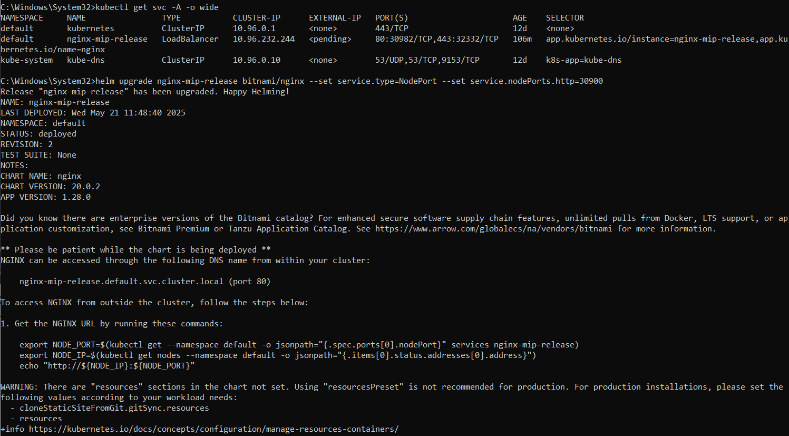
   - Compruebo los cambios
     ```bash
     helm get values nginx-mip-release
     ```
     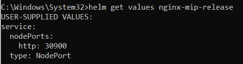

---

## **Parte 4: Gestionar el historial de releases**

3. **Revisar el historial de versiones del release**
   - Compruebo el historial de versiones
     ```bash
     helm history nginx-mip-release
     ```
     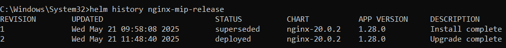

4. **Realizar un rollback**
   - Vuelvo a la versión anterior. 
     ```bash
     helm rollback nginx-mip-release 1
     ```
   - Vuelvo a revisar el historial
     ```bash
     helm history nginx-mip-release
     ```
     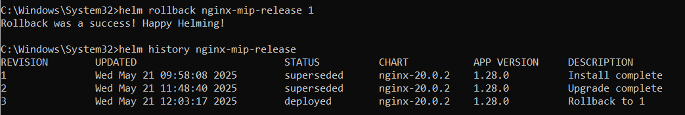

   > **Pregunta**: ¿Qué ocurrió tras realizar el rollback?
        Trás realizar el rollback vuelvo a la versión 1. El resto de versiones pasan a estar inactivas. 
---

## **Parte 5: Eliminar el release**

5. **Elimina el release**
   - Elimino el release de mi cluster. 
     ```bash
     helm uninstall nginx-mip-release
     ```
     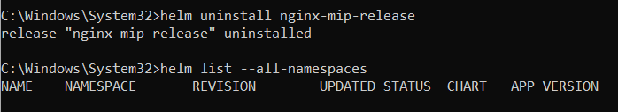
