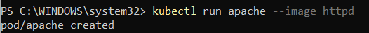
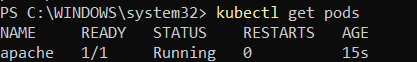
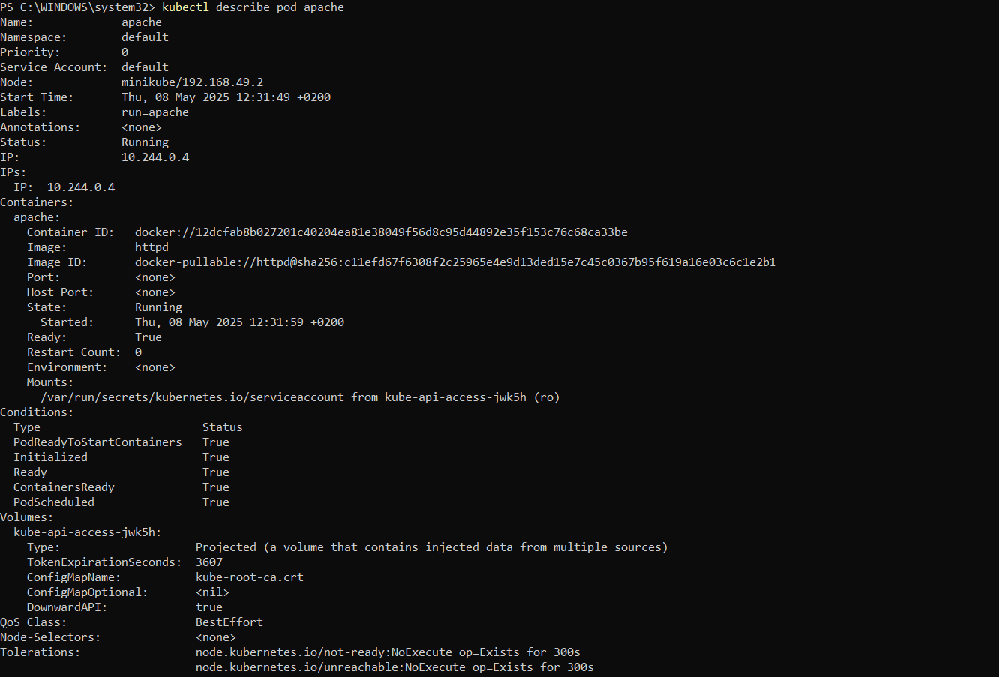
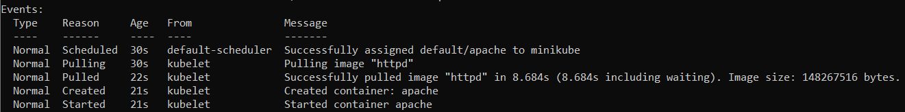
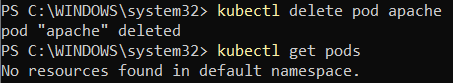

# Ejercicio 01
Después de instalar minikube y kubectl comienzo con la ejecución de los ejercicios. 
Empezamos por lo básico, creación de pods, listado, descripción y eliminación. Los comandos los encuentro en la documentación oficial (kubernetes.io). 

## Crear POD
Creo un POD llamado **apache**, con la imagen **httpd** y de **forma imperativa**. 
```powershell
kubectl run apache --image=httpd
```


## Listar POD
```powershell
kubectl get pods
```



## Describir POD
Con este comando obtengo las propiedades del pod. 
```powershell
kubectl describe pod apache 
```



## Eliminar POD
```powershell
kubectl delete pod apache 
```
