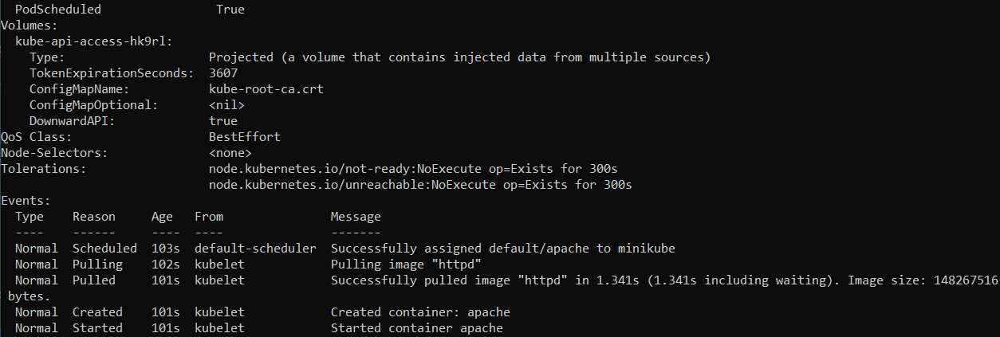

# Ejercicio 02
Realizo lo mismo que en el anterior ejercicio, pero en este caos croe el pod de forma declarativa, esto quiere decir que lo debo hacer en un archvio **yaml**.

## Crear POD
Utilizo la estructura del curso para crear el archivo. 
```powershell
kubectl create -f pod_apache02.yml
```
```yaml
apiVersion: v1
kind: Pod
metadata:
  name: apache
  labels:
    version: v1
spec:
  containers:
   - name: apache
     image: httpd

```


## Listar POD
```powershell
kubectl get pods
```


## Describir POD
En este ejercicio he utilizado este comando y el siguiente diferente a como lo hice en el ejercicio anterior. Aquí me he basado en los videos y en el anterior me basé en la documentación oficial. 
```powershell
kubectl describe pod/apache
```



## Eliminar POD
```powershell
 kubectl delete pod/apache 
```
