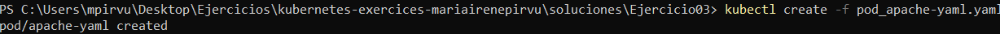
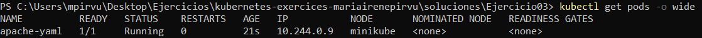
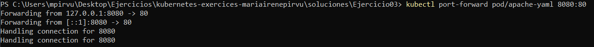
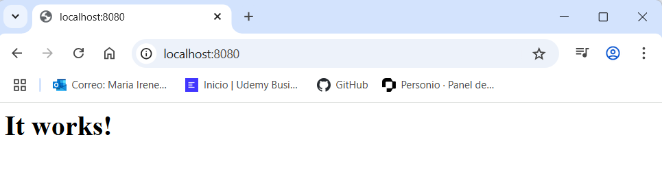
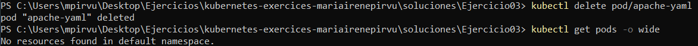

# Ejercicio 03
Trabajé en base al ejercicio dos añadiendo:
* Política de reinicio
* Listado de pods más extenso 
* Port forwarding

## Crear POD
Añado la siguiente política **restartPolicy: Always**. Esta política hace que el POD se reinicie automáticamente en caso de fallo o detención. Esta política se suele aplicar a servicios que siempre deben estar activos. 

```powershell
kubectl create -f pod_apache-yaml.yml
```

```yaml
apiVersion: v1
kind: Pod
metadata:
  name: apache-yaml
  labels:
    version: v1
spec:
  containers:
   - name: apache
     image: httpd
  restartPolicy: Always 
```



## Listar POD con toda la información posible 
Para obtener más información añado el parámetro **-o wide**.

```powershell
kubectl get pods -o wide
```



## Conexión puerto POD 
Realizo Port Forwarding para poder acceder a los servicios sin tener que exponerlos de forma pública. Esta técnica redirige el tráfico desde un puerto local de mi equipo al puerto del contenedor del POD. 
```powershell
kubectl port-forward pod/apache-yaml 8080:80
```



## Eliminar POD
```powershell
 kubectl delete pod/apache-yaml
```
