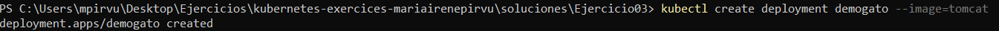
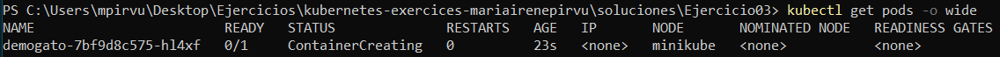
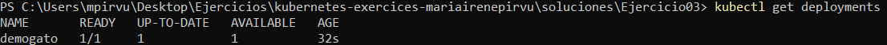
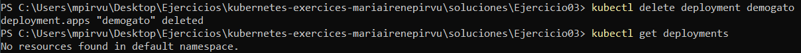
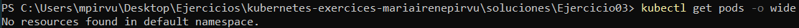

# Ejercicio 04
En este ejercicio creo el deployment, listo el pod y el deployment, elimino el deployment y vuelvo a listar el pod para comprobar la correcta eliminación. 


## Crear DEPLOYMENT
Creo el depoyment de forma imperativa, la estructura es la misma simplemente cambiamos pod por deployment.
```powershell
kubectl create deployment demogato --image=tomcat 
```



## Listar POD 
Listo de manera más detallada. 
```powershell
kubectl get pods -o wide
```



## Listar DEPLOYMENT

```powershell
kubectl get deployments
```



## Eliminar DEPLOYMENT
Al eliminar el deployment lo compruebo listando el deployment aunque en el siguiente ejercicio liste el pod, me gusta siempre realizar todas las comprobaciones necesarias. 

```powershell
 kubectl delete deployment demogato
```


## Listar POD 

