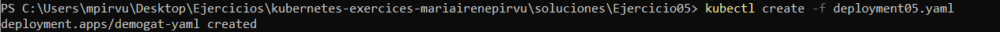
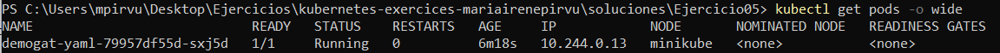
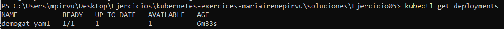
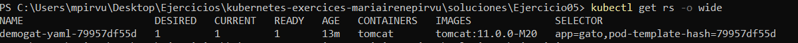

# Ejercicio 05
Realizo un deployment de forma declarativa con las siguientes características:
* Nombre > demogat-yaml
* Imagen > tomcat:11.0.0-M20
* Nombre del contenedor > tomcat
* Etiqueta > app: gato

## Crear DEPLOYMENT
El deployment lo creo utilizando como plantilla el del vídeo de la guía. Es muy importante escribir bien las minúsculas y las mayúsculas ya que kubernetes es muy sensible. 
 
```powershell
kubectl create -f deployment05.yaml
```

```yaml 
apiVersion: apps/v1
kind: Deployment
metadata:
  name: demogat-yaml # Nombre del deployment
spec:
  replicas: 1 # Número de replicas 
  selector:
    matchLabels:
      app: gato
  template: # Plantilla para el pod
    metadata:
      labels:
        app: gato # Etiqueta para identificar el pod 

    spec:  
      containers:
      - name: tomcat # Nombre del contenedor 
      image: tomcat:11.0.0-M20
```



## Listar POD 
Listo de manera más detallada. 
```powershell
kubectl get pods -o wide
```



## Listar DEPLOYMENT

```powershell
kubectl get deployments
```


## Listar ReplicaSets 
Listando los ReplicaSets podemos observar la etiqueta y el nombre del contenedor, cosa que listando los pods o los deployments no se aprecian. 
```powershell
kubectl get rs -o wide
```

