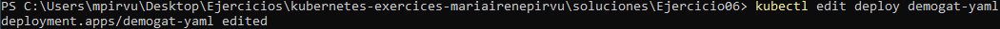
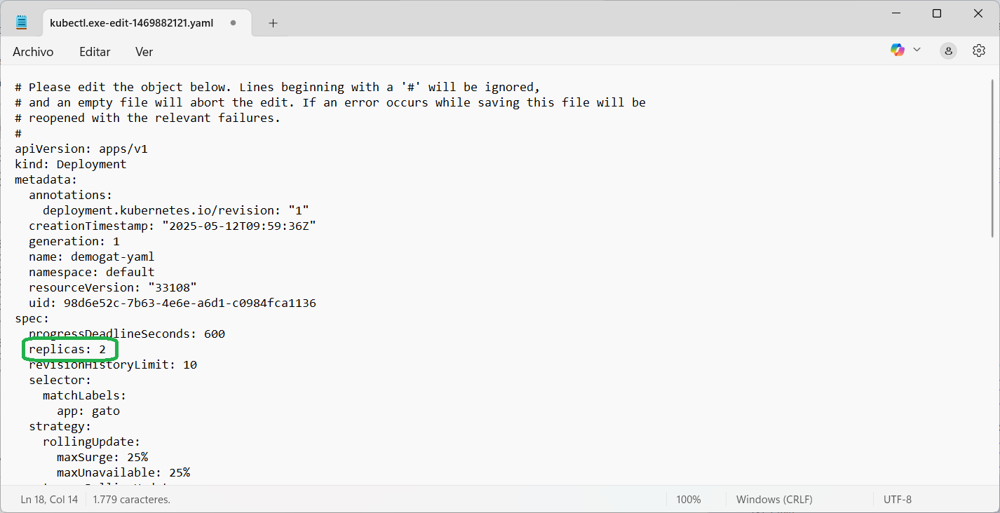
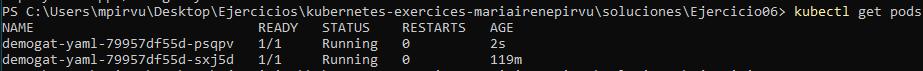
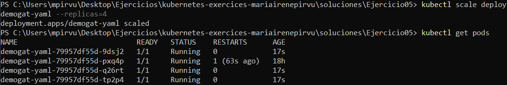
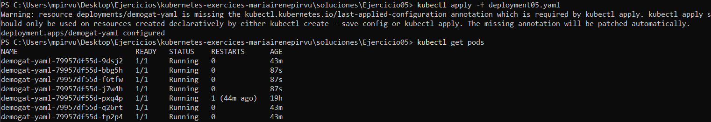
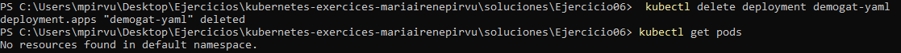

# Ejercicio 06
Utilizo 3 métodos diferentes para modificar las réplicas:
* Utilizando el comando **edit**
* Utilizando el comando **scale** 
* Editándolo manualmente y aplicando los cambios 

## Comando Edit
Edito el archivo con el comando que se muestra a continuación, guardo el archivo y lo listo para observar el cámbio. 
```powershell
kubectl edit deploy demogat-yaml
```



### Listo los pods 

```powershell
kubectl get pods
```



## Comando Scale
Utilizando el comando **scale** aumento a las réplicas deseadas. 
```powershell
kubectl scale deploy demogat-yaml --replicas=4
kubectl get pods
```


## Edición manual 
Abro el documento de forma manual o por comandos, modifico las réplicas y aplico los cambios. 
```powershell
kubectl apply -f deployment05.yaml
kubectl get pods
```



## Eliminar DEPLOYMENT

 ```powershell 
 kubectl delete deployment demogat-yaml
 ```

 