# Ejercicio 07
Siguiendo la guía de Udemy y utilizando los recursos del video realizo un despligue con Docker y con Kubernetes. 

Realizando el mismo despliegue con diferentes tecnologías observo las diferencias que existen entre estas:

* Docker -> Manual <br>
El despliegue lo realizo mediante comandos, construyendo la imagen, ejecutando el contenedor y mapenado los puertos. Está orientado sobretodo a entornos locales o de pruebas. 
* Kubernetes -> Automático <br>
El despliegue se define en un archivo YAML. Kubernetes se encarga del resto; crea los pods, expone el servicio y gestiona el estado del contenedor. Está orientado más a entornos profesionales y escalables. 

# Docker 
## Contrucción de la imagen 
Construyo la imagen Docker a partir del Dockerfile proporcionado con el nombre **apasoft** y la etiqueta **web**.
```powershell
docker build -t apasoft/web .
```
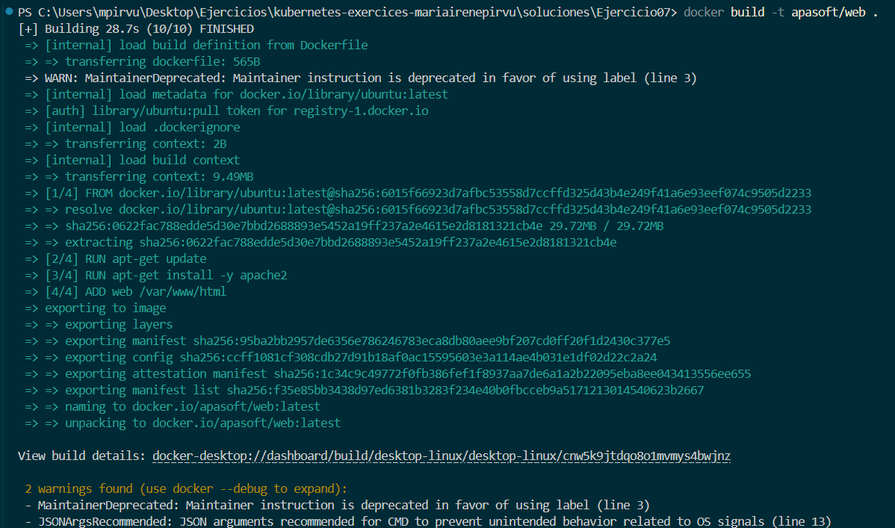

### Comprobación creación imagen 
```powershell 
docker image ls 
```
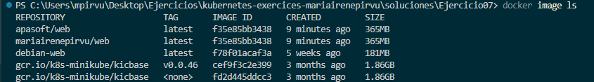

### Lanzamiento imagen 
Lanzo un contenedor con la imagen creada anteriormente y redirijo mi puerto local (9090) al del contenedor (80).
```powershell 
docker run --name=web1 -d -p 9090:80 apasoft/web
```
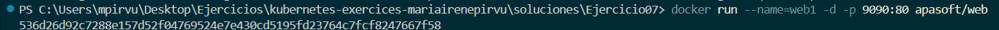
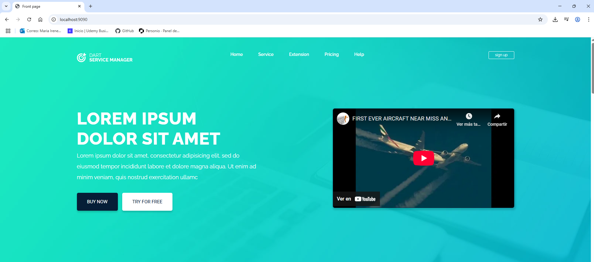

## Parada y eliminado del contenedor 
```powershell 
docker stop web1
docker rm web1
```

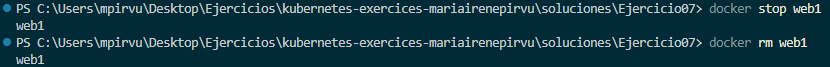


## Subida a DockerHub
Subo la imagen a mi DockerHub. 

```powershell
 docker login
 docker tag apasoft/web mariairenepirvu/web:latest
 docker push mariairenepirvu/web:latest
```
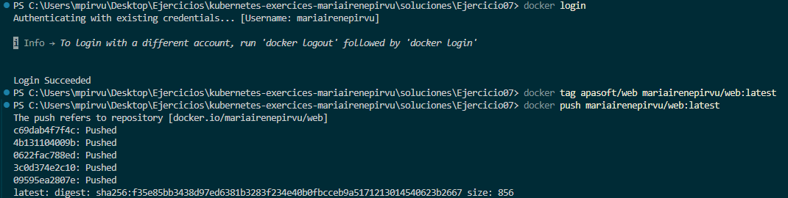
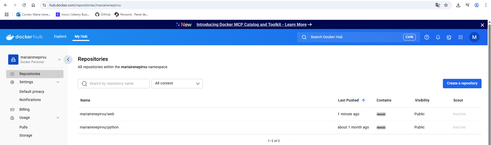

<br>


# Kubernetes

## Despliegue de completo.yaml
Aplico la configuración del archivo **completo.yaml**, este contiene un Deployment y un Service. 
```powershell
kubectl apply -f completo.yaml
```
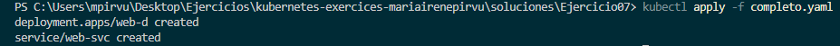

## Comprobación 
Compruebo que el pod se creó correctamente. 
```powershell
kubectl get pod
```
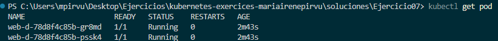

Compruebo los servicios activos.
```powershell
kubectl get svc
```
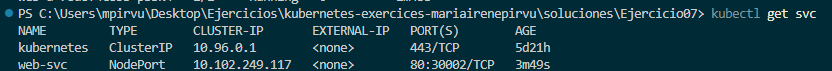


### Comprobación navegador 
Cuando quise comprobar la app desde el navegador, por mucho que siguiera paso a paso el video, no funcionaba correctamente. Investigando, averigué que necesito ejecutar el comando que se muestra a continuación porque Kubernetes por defecto crea un Service que no es accesible desde fuera del clúster.
En Docker con añadir -p (puertos) puedes acceder desde el navegador, con Minikube necesitas ejecutar **minikube service <nombre servicio>**.

```powershell
 minikube service web-svc
```

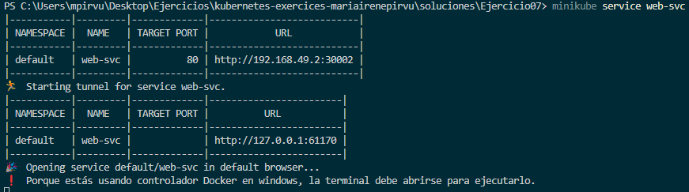

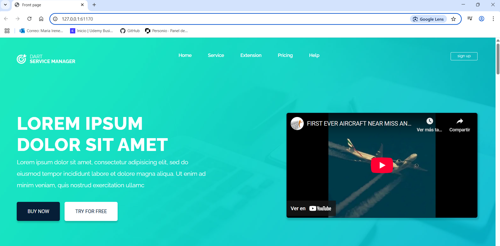

## Eliminado
```powershell 
kubectl delete -f completo.yaml
```

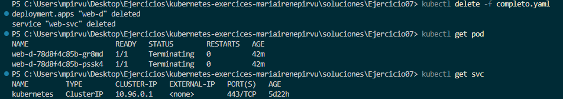
