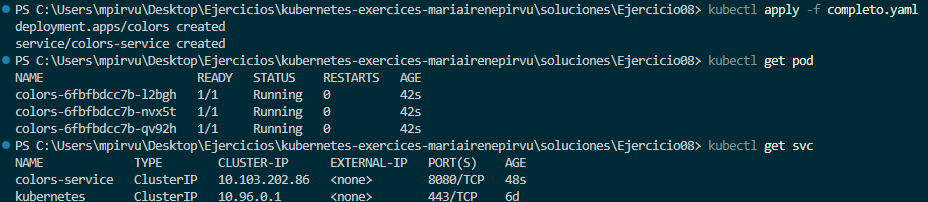
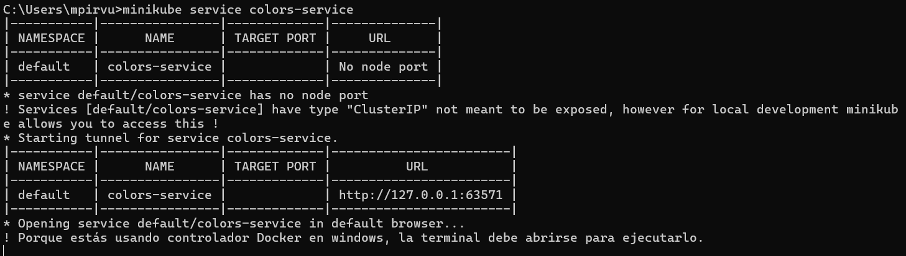
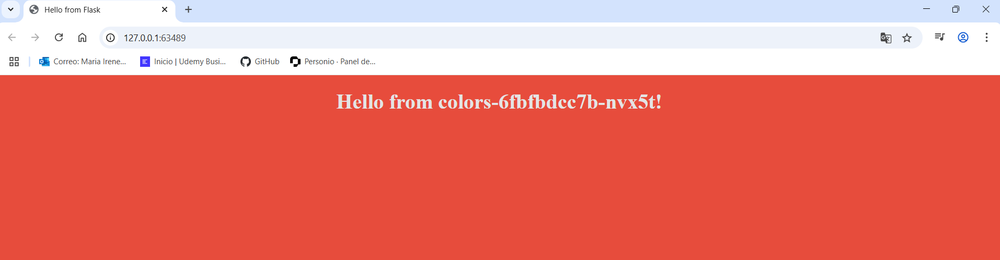
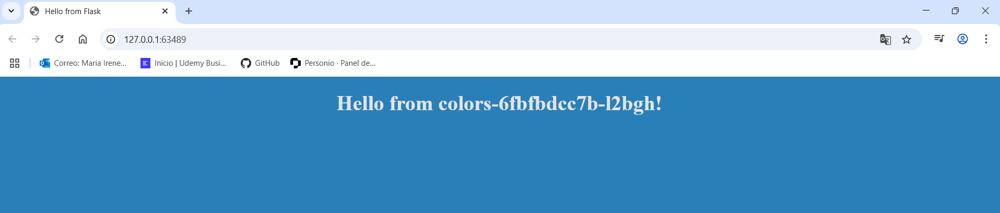
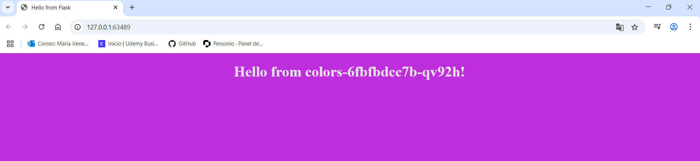

# Ejercicio 08
Creo un manifiesto con un deployment y un service con las siguientes características:
* Deployment
  * Nombre -> colors
  * Imagen -> noloknolo/colors
  * Nombre contenedor -> coloread
  * Replicas -> 3
  * Etiqueta -> colors-app
  * Puerto -> 8080
* Service 
  * Nombre -> colors-service
  * Tipo -> ClusterIP
  * Puerto -> 8080
  * Etiqueta -> colors-app

## Contrucción de la app
He seguido la estructura del ejercicio anterior por lo tanto tengo en el mismo archivo el deployment y el service. 

```yaml
#############
# DEPLOYMENT  
#############
apiVersion: apps/v1 
kind: Deployment
metadata:
  name: colors
spec:
  selector:   
    matchLabels:
      app: colors-app
  replicas: 3 # Indica al controlador que ejecute 3 pods
  template:   
    metadata:
      labels:
        app: colors-app
    spec:
      containers:
      - name: coloread
        image: noloknolo/colors:v1 # Versión encontrada en DockerHub
        ports:
        - containerPort: 8080 # Puerto encontrado en DockerHub
---

#############
# SERVICIO  
#############
apiVersion: v1
kind: Service
metadata:
  name: colors-service
  labels: 
     app: colors-app
spec:
  type: ClusterIP
  ports:
  - port: 8080 
    protocol: TCP
  selector:
    app: colors-app


```
<br>
Aplico el archivo del deployment y service, y observo los pods y servicios. 

```powershell
kubectl apply -f completo.yaml
kubectl get pod
kubectl get svc 
```


## Conexión al puerto local 
Conecto el servicio al puerto local.

```powershell
minikube service colors-service
```


## Comprobación navegador 
Recargo lapágina varias veces hasta encontrar los 3 colores. 


