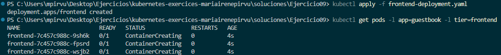

# Ejercicio 09
Realizamos el ejercicio propuesto en la sección 10, este consiste en lanzar la aplicación Redis:
* redis-leader -> Nodo principal de Redis
* redis-follower -> Nodos que replican los datos del líder
* frontend -> La app web que se conecta a Redis

Además de la guía de Udemy he seguido https://cloud.google.com/kubernetes-engine/docs/tutorials/guestbook?hl=es-419.

## Configuración líder de Redis
Esta configuración usa la imagen oficial de Redis y expone el puerto 6379 (puerto por defecto de Redis).

```yaml
apiVersion: apps/v1
kind: Deployment
metadata:
  name: redis-leader
  labels:
    app: redis
    role: leader
    tier: backend
spec:
  replicas: 1
  selector:
    matchLabels:
      app: redis
  template:
    metadata:
      labels:
        app: redis
        role: leader
        tier: backend
    spec:
      containers:
      - name: leader
        image: "docker.io/redis:6.0.5"
        resources:
          requests:
            cpu: 100m
            memory: 100Mi
        ports:
        - containerPort: 6379
```
<br>

Aplico la configuración y muestro los pods. 
```powershell
kubectl apply -f redis-leader-deployment.yaml
kubectl get pods
```


## Creación servicio líder de Redis
Este service permite la comunicación de otros pods con el pod del líder. 

```yaml
apiVersion: v1
kind: Service
metadata:
  name: redis-leader
  labels:
    app: redis
    role: leader
    tier: backend
spec:
  ports:
  - port: 6379
    targetPort: 6379
  selector:
    app: redis
    role: leader
    tier: backend
```
<br>

Aplico la configuración y muestro el servicio. 

```powershell
kubectl apply -f redis-leader-service.yaml
kubectl get service 
```

<br>

## Configuración seguidores de Redis 
La configuración define 2 réplicas para alta disponibilidad de los seguidores, utiliza una imagen personalizada y expone el puerto 6379.

```yaml
apiVersion: apps/v1
kind: Deployment
metadata:
  name: redis-follower
  labels:
    app: redis
    role: follower
    tier: backend
spec:
  replicas: 2
  selector:
    matchLabels:
      app: redis
  template:
    metadata:
      labels:
        app: redis
        role: follower
        tier: backend
    spec:
      containers:
      - name: follower
        image: us-docker.pkg.dev/google-samples/containers/gke/gb-redis-follower:v2
        resources:
          requests:
            cpu: 100m
            memory: 100Mi
        ports:
        - containerPort: 6379
```
<br>

Aplico la configuración y muestro los pods.

```powershell
kubectl apply -f redis-follower-deployment.yaml
kubectl get pods
```


## Creación Service para seguidores de Redis
Este service permite a otros componentes acceder a cualquier seguidor haciendo uso de balanceo de carga y selecciona los pods mediante etiquetas.

```yaml
apiVersion: v1
kind: Service
metadata:
  name: redis-follower
  labels:
    app: redis
    role: follower
    tier: backend
spec:
  ports:
  - port: 6379
  selector:
    app: redis
    role: follower
    tier: backend
```
<br>

Aplico la configuración y muestro los servicios. 

```powershell
kubectl apply -f redis-follower-service.yaml
kubectl get service
```


<br>

## Configuración frontend web de la aplicación
El Frontend muestra el libro de visitas en la web, utiliza una imagen para comunicarse con Redis, crea 3 réplicas y expone el puerto 80. 

```yaml
apiVersion: apps/v1
kind: Deployment
metadata:
  name: frontend
spec:
  replicas: 3
  selector:
    matchLabels:
        app: guestbook
        tier: frontend
  template:
    metadata:
      labels:
        app: guestbook
        tier: frontend
    spec:
      containers:
      - name: php-redis
        image: us-docker.pkg.dev/google-samples/containers/gke/gb-frontend:v5
        env:
        - name: GET_HOSTS_FROM
          value: "dns"
        resources:
          requests:
            cpu: 100m
            memory: 100Mi
        ports:
        - containerPort: 80
```
<br>

Aplico la configuración y muestro los pods con las etiquetas app y tier indicadas. 

```powershell
kubectl apply -f frontend-deployment.yaml
kubectl get pods -l app=guestbook -l tier=frontend
```



## Exposición frontend a dirección IP externa
Expone los pods del frontend y permite el acceso desde fuera del clúster con LoadBalancer. 

```yaml
apiVersion: v1
kind: Service
metadata:
  name: frontend
  labels:
    app: guestbook
    tier: frontend
spec:
  type: LoadBalancer
  ports:
  - port: 80
  selector:
    app: guestbook
    tier: frontend
```
<br>


Aplico los cambios.

```powershell
kubectl apply -f frontend-service.yaml
```


## Ejecución aplicación en navegador

```powershell
minikube service frontend
```


<br>


## Comprobaciones según etiquetas 
Las etiquetas nos permiten organizar, filtrar y gestionar mejor los recursos. A continuación muestro la información de dichas etiquetas.

### app=redis
```powershell
kubectl get all -l app=redis
```


### role=follower
```powershell
kubectl get all -l role=follower
```


### tier=backend
```powershell
kubectl get all -l tier=backend
```


