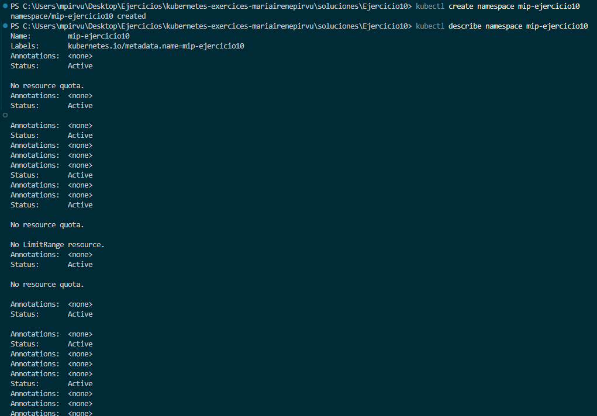

# Ejercicio 10

## Creación namespace. Manera Imperativa
Creo un namespace de forma imperativa y muestro su información. 
 
```powershell
kubectl create namespace mip-ejercicio10 
kubectl describe namespace mip-ejercicio10 
```


## Aplicación de limitaciones. Manera Declarativa
Aplico limitaciones de recursos a mi namespace, todo esto de forma declarativa. Las limitaciones son:
* Máximo
  * 1 CPU
  * 1GB de memoria
* Mínimo
  *  0.5 CPU
  *  0.5GB de memoria

 ```yaml

 ```
 
```powershell
kubectl apply -f namespace.yaml
kubectl describe namespace mip-ejercicio10
```


