## Paso 1: Instalación de [Kube-prometheus-stack](https://artifacthub.io/packages/helm/prometheus-community/kube-prometheus-stack)
Prometheus se puede instalar fácilmente en Kubernetes usando Helm. Helm es un gestor de paquetes para Kubernetes que facilita el despliegue de aplicaciones.


1. **Añadir el repositorio de Helm de Kube-prometheus-stack**
```
helm repo add prometheus-community https://prometheus-community.github.io/helm-charts

helm repo update

helm install my-kube-prometheus-stack prometheus-community/kube-prometheus-stack --version 72.6.2
```

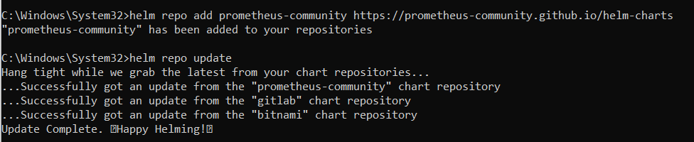
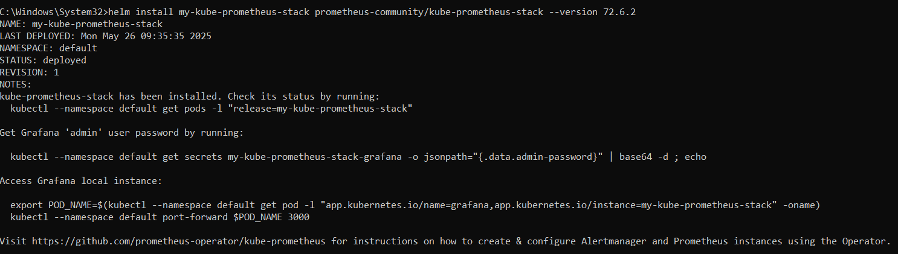


#### Contraseña   
```
kubectl get secret my-kube-prometheus-stack-grafana -n default -o jsonpath="{.data.admin-password}"
```
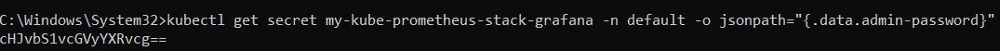

La otengo en base64 -> cHJvbS1vcGVyYXRvcg==

Descodifico la contraseña en https://www.base64decode.org/es/

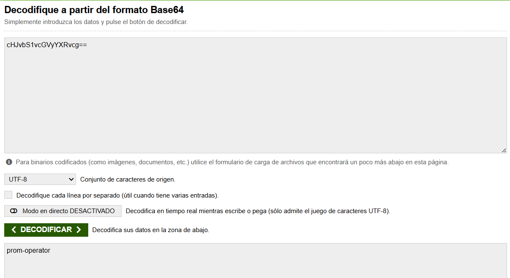

<br>

1. **Desplegar Kube-prometheus-stack usando Helm** <br>
Al instalarlo se despliega automáticamente 

1. **Verificar el despliegue de Kube-prometheus-stack**

kubectl get pods 
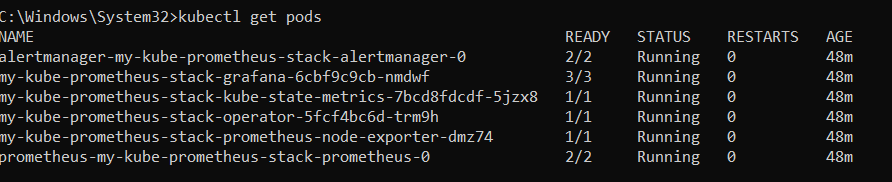

3. **Acceder a la interfaz web de Prometheus**

    - Para acceder a la interfaz web de Prometheus, realiza un port-forward del servicio de Prometheus
```
  kubectl port-forward svc/my-kube-prometheus-stack-prometheus 9090:9090
```

  http://localhost:9090

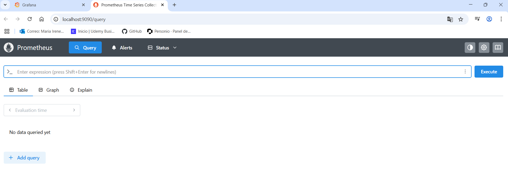

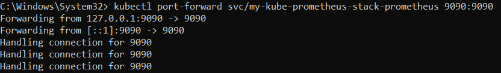


1. **Acceder a la interfaz web de Grafana**:

    - Para acceder a la interfaz web de Prometheus, realiza un port-forward del servicio de Grafana

kubectl port-forward svc/my-kube-prometheus-stack-grafana 3000:80
http://localhost:3000


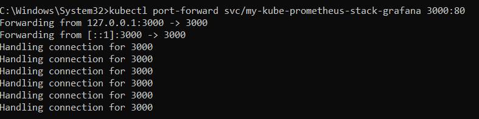

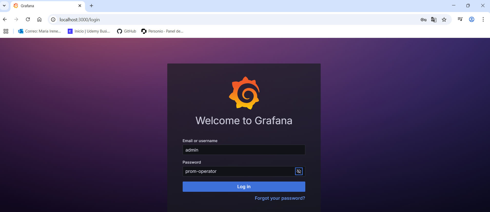


## Paso 2: Creación de Dashboards en Grafana

1. **Crear un nuevo dashboard**:

  - Me dirijo a Dashboards > New Dashboard.
  - Añado un nuevo panel en **Add new panel**.

2. **Configurar el panel**:

  - Selecciono Prometheus como la fuente de datos.

  - Ingresa una consulta de PromQL para las métricas que deseas visualizar. Ejemplo:

  ```promql
  rate(http_requests_total[5m])
  ```
  - Configura las opciones de visualización según tus preferencias.

   - Importar y crear dashboards en Grafana para visualizar métricas del clúster:
     
     
    - Memoria RAM en uso

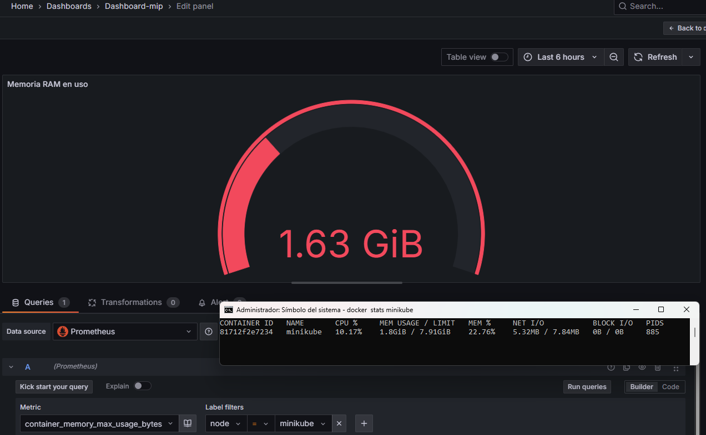

     - CPU en uso
  
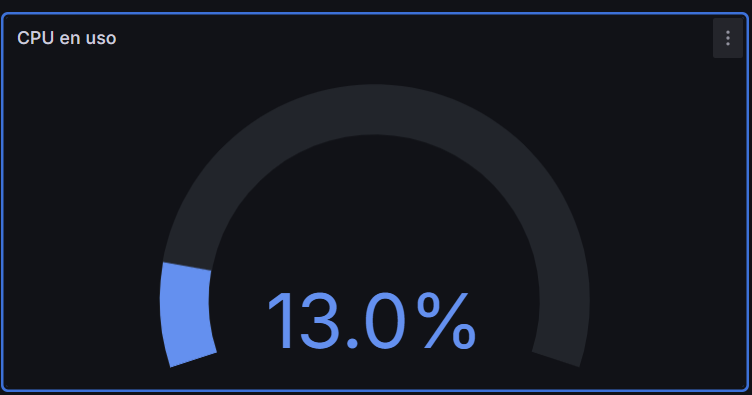
 
     - Espacio libre en disco
   
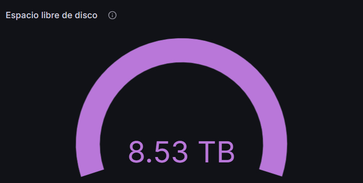


