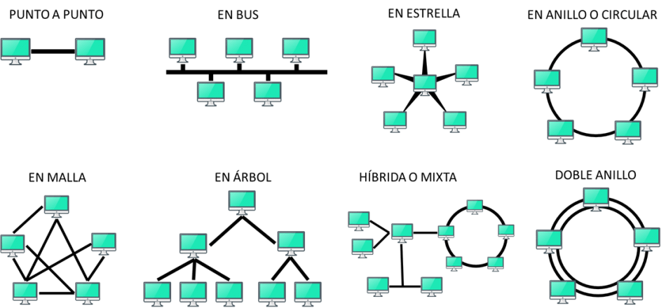

# Ejercicio 2 - Topologías

1. Dar una ventaja y una desventaja de cada topologia que hemos visto.
La siguiente tabla muestra las topologías según el video de Udemy. 

| **Topología**         | **Ventajas**                                                                                                                                                          | **Desventajas**                                                                                                                                              |
|------------------------|------------------------------------------------------------------------------------------------------------------------------------------------------------------------|---------------------------------------------------------------------------------------------------------------------------------------------------------------|
| **Punto a punto**      | Solo hay un canal para comunicar dos nodos. Ambos actúan como iguales: uno puede ser maestro del otro y viceversa.                                                    | Solo conecta dos dispositivos. No sirve para redes más grandes.                                                                                               |
| **Bus**                | Un único canal de datos al que se conectan todos los dispositivos.   Fácil de instalar, poco cableado.   Se pueden añadir o quitar nodos fácilmente.             | Si se rompe el cable principal, toda la red se cae.   Puede ser difícil detectar fallos.                                                                   |
| **Anillo**             | Nodos conectados de forma circular.   El flujo de datos va en una sola dirección y pasa por todos los nodos.                                                       | Si un nodo o un cable falla, la red se puede caer.   Cuantos más nodos, más lenta puede ser la transmisión.                                                |
| **Doble anillo**       | Igual que el anillo, pero con un segundo anillo que envía los datos en la dirección contraria.   Más velocidad entre nodos lejanos.   Mayor resistencia a fallos. | Cuantos más nodos, menor velocidad de transmisión.   Más cableado que el anillo normal.                                                                    |
| **Estrella**           | Todos los nodos se conectan a uno central.   Si un nodo falla, no afecta a los demás.   Fácil de ampliar o reducir equipos.                                      | Si cae el nodo central, toda la red se queda sin conexión.                                                                                   |
| **Árbol**              | Variante de la estrella pero con estructura jerárquica.   Muy usada en redes telefónicas.                                                                           | Si un nodo intermedio cae, puede dejar a muchos nodos sin conexión.                                                                                           |
| **Malla**              | Todos los nodos están interconectados, así que la información puede tomar varios caminos.   Más eficiente en rendimiento.                                           | Muy cara y difícil de instalar.   Poco viable para mantener o ampliar.                                                                                     |
| **Conexa** | Igual que la malla, pero todos los nodos están conectados entre sí directamente.   Máxima redundancia y fiabilidad.                                                 | Requiere mucho más cableado.   Coste muy alto.                                                                                                              |
| **Híbrida**            | Combinación de varias topologías.   Permite crear redes más amplias y adaptadas a las necesidades.                                                                 | Más compleja de configurar y mantener.                                                                                                                        |

  

2. Analizar la red de vuestra oficina y justificar que topología es.

En mi opinión, la red de la oficina es de tipología en árbol porque todas las salas dependen de un router principal. Si este falla todas las salas se quedan sin conexión. 