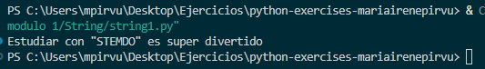
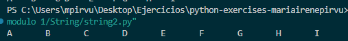
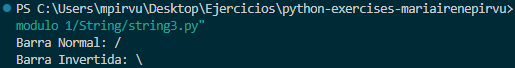
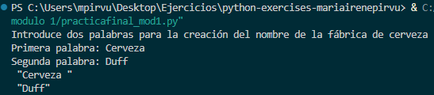

## MÓDULO 1 

### String 1
Añado \ para que se visualicen las comillas al hacer el print.

`print ("Estudiar con \"STEMDO\" es super divertido")`




### String 2

Añado \t para que se visualicen las tabulaciones al hacer el print

`print("A\tB\tC\tD\tE\tF\tG\tH\tI")`



### String 3

Añado \n para que se visualicen los saltos de linea al hacer el print y \\ para que se visualice \ al hacer el print.

`print ("Barra Normal: / \nBarra Invertida: \\")`



### Práctica final. Módulo 1

```python 
print("Introduce dos palabras para la creación del nombre de la fábrica de cerveza")
# Introducimos en una variable la primera palabra
palabra1 = input("Primera palabra: ")
# Introducimos en una variable la segunda palabra
palabra2 = input("Segunda palabra: ")
# Mostramos por pantalla el resultado en diferentes líneas y entre comillas.
print(f' "{palabra1}" \n "{palabra2}" ')
```


