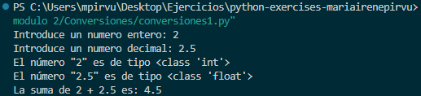
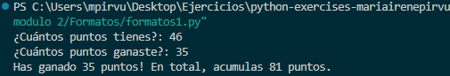
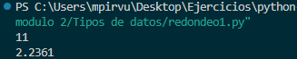
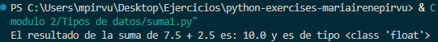
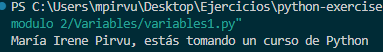
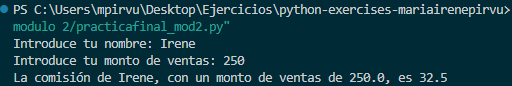

## Módulo 2

### Conversiones 
Convertimos los números en entero y decimal y sacamos por pantalla la suma de estos.

```python
# Pide el valor de la variable num1
num1 = input ("Introduce un numero entero: ")
# Pide el valor de la variable num2
num2 = input ("Introduce un numero decimal: ")
# Convierte num1 en entero  
num1 = int(num1)
# Sacamos por pantalla el tipo
print(f"El número \"{num1}\" es de tipo {type(num1)}")
# Convierte num1 en decimal  
num2 = float(num2)
# Sacamos por pantalla el tipo
print(f"El número \"{num2}\" es de tipo {type(num2)}")
# Sacamos por pantalla la suma de ambos números 
print(f"La suma de {num1} + {num2} es: {num1 + num2}")  
```



### Formatos 
Solicitamos números, los convertimos a enteros y los sacamos por pantalla.

```python 
# Solicita la cantidad de puntos anteriores y nuevos. Además convertimos a numero entero
puntos_anteriores = int(input("¿Cuántos puntos tienes?: "))  
puntos_nuevos = int(input("¿Cuántos puntos ganaste?: "))  

# Calcula los puntos totales
puntos_totales = puntos_anteriores + puntos_nuevos


print(f"Has ganado {puntos_nuevos} puntos! En total, acumulas {puntos_totales} puntos.")
```



### Redondeo 
Utilizamos **round** para redondear. En el primer caso, al no especificar decimales, reondea al número entero más cercano. En el segundo redondea a 4 decimales.

```python
# Redondea el número 10.676767 al entero más próximo y muestra en pantalla el resultado
print(f"El número 10.676767 redondeado al entero más próximo es: {round(10.676767)}")

# Calcula la raíz cuadrada de 5 y redondear a 4 decimales, muestra en pantalla el resultado
raiz_cuadrada = round(5 ** 0.5, 4)
print(f"La raíz cuadrada de 5 redondeada a 4 decimales es: {raiz_cuadrada}")
```



### Suma1
Sumamos los valores dados, mostramos el resultado y el tipo de este resultado.

```python
# Declaro las variables
num1 = 7.5
num2 = 2.5

# Muestro el resultado de la suma y el tipo de dato resultante
print(f"El resultado de la suma de {num1} + {num2} es: {num1 + num2} y es de tipo {type(num1 + num2)}")
```



### Variables 
Declaramos las variables y las sacamos por pantalla haciendo uso de la concatenación (+). 

```python
# Declaro las variables
nombre = "María Irene"
apellido = "Pirvu"
curso = "Python"

# Concatenación de cadenas
print(nombre + " " + apellido + ", estás tomando un curso de " + curso)
```


### Práctica final. Módulo 2
Declaramos las variables y la de ventas la convertimos en tipo float. Seguidamente calculamos la comisión declarando otra variable. Finalmente sacamos por pantalla las variables declaradas. 

```python
# Declaro las variables 
nombre = input ("Introduce tu nombre: ")
ventas = input ("Introduce tu monto de ventas: ")
# Convierto el valor de ventas en tipo float
ventas = float(ventas)
# Calculo la comisión 
comision = ventas * 0.13

# Saco por pantalla los valores
print (f"La comisión de {nombre}, con un monto de ventas de {ventas}, es {comision}")
```

