## Módulo 3

### Booleanos 
Realizo la comparación de dos operaciones e imprimimos por pantalla si es **Verdadero** o **Falso**.

```python
# Verificamos las operecaciones 
raiz = (25 ** 0.5) == (65/13)

# Imprimimos el tipo del resultado de raiz  
print(type(raiz))

# Imprimimos el resultado en booleano de raiz
print(raiz) 
```

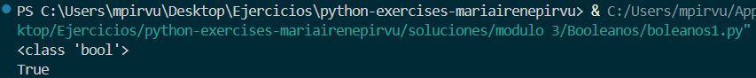

### Diccionarios 
Creo un diccionario, saco por pantalla el valor de una clave, y posteriormente cambio algunos valores y añado otro nuevo.

```python
# Creo un diccionario con los datos proporcionados
diccionario1 = {'nombre':'Karen','apellido':'Jurgens','edad':'35','ocupacion':'Periodista'}
# Imprimo el valor de la clave apellido
print(diccionario1['apellido'])

# Modifico los valores de edad y ocupación
diccionario1['edad'] = '36'
diccionario1['ocupacion'] = 'Editora'
# Añado una nueva clave, pais.
diccionario1['pais'] = 'Colombia'
# Muestro por pantalla los nuevos valores del diccionario
print(diccionario1)
```
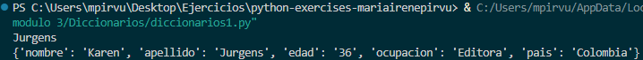

### Listas1
Creo una lista con elementos, utilizo los tipos que hemos dado hasta ahora (strings, boolean, números y listas). Elimino uno de los elementos y lo introduzco en una variable.

```python
# Creo una lista con 5 elementos
mi_lista = ['Motocicleta', '800', 'True', '5.6', ['rojo', 'negro', 'azul'] ]
# Imprimo el tipo 
print(type(mi_lista))
# Imprimo el valor de 'mi_lista'
print(mi_lista)

# Almaceno el tercer elemento en una variable y lo elimino con .pop
eliminado = mi_lista.pop(2)

# Imprimo el valor de 'mi_lista'
print(mi_lista)

# Imprimo el valor de 'eliminado'
print(f"El elemento eliminado es: {eliminado}")
```
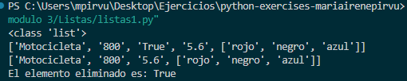

### MétodoIndex1

```python
# Declaramos la variable
palabra = "Ordenador"

# Sacamos por pantalla el carácter que ocupa la quiran posición 
print(f"El quinto elemento de {palabra} es: {palabra[4]}")
```

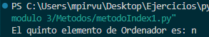


### MétodoIndex2


```python
# Declaro la variable frase 
frase = "En teoría, la teoría y la práctica son los mismos. En la práctica, no lo son."

# Declaro la variable primera y encontramos la primera palabra con el método .find
primera = frase.find("práctica")

# Imprimo la primera aparición de 'práctica'
print(f"La primera aparición de la palabra práctica es: {primera}")

# Declaro la variable ultima y encontramos la última palabra con el método .rfind
ultima = frase.rfind("práctica")

# Imprimo la última aparición de 'práctica'
print(f"La última aparición de la palabra práctica es: {ultima}")
```

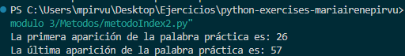

### MétodoString

```python
# Creamos la lista 
lista_palabras = ["Si", "la", "implementación", "es", "difícil", "de", "explicar,", "puede", "que", "sea", "una", "mala", "idea"]

# Introducimos la lista en una varibale y le añadimos .join y .upper para que se convierta en un solo string y se imprima en mayúsculas. 
resultado = ' ' .join(lista_palabras).upper()

# Imprimimos el resultado
print (resultado)

# Utilizamos . replace para modificar las palabras 
resultado2= resultado.replace( 'DIFÍCIL', 'FÁCIL').replace('MALA', 'BUENA')

# Imprimimos por pantalla los nuevos resultados
print (resultado2)
```

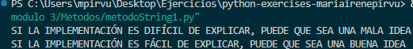

### PropiedadesString1

```python

# Declaramos la variable repetición
texto = "Repetición " 

# Multiplicamos texto por 15 para que se repita esas veces
resultado= texto * 15

# Mostramos por pantalla el texto 
print(resultado)
```

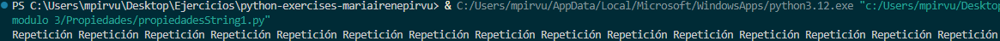

### PropiedadesString2

```python
# Declaro la variable haiku 
haiku= ( """Tierra mojada,

mis recuerdos de viaje

entre las lluvias""")

# Muestro por pantalla el valor de haiku
print(haiku)

# Verifico si la palabra "agua" no está en haiku
resultado = "agua" not in haiku

# Muestro por pantalla el resultado de la verificación 
print(resultado)
```
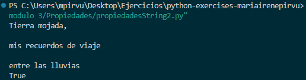

### PropiedadesString3

```python
# Declaramos una variable 
palabra = "electroencefalografista"

# Declaramos la variable longitud y contamos el número de caracteres
longitud = len(palabra)

# MOstramos por pantalla el resultado de 'longitud'
print(f"La palabra \"{palabra}\" consta de {longitud} caracteres.")
```

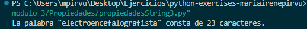

### Tuples1

```python
# Declaro la dupla
mi_tupla = (1, 2, 3, 2, 3, 1, 3, 2, 3, 3, 3, 1, 3, 2, 2, 1, 3, 2)

# Cuento las veces que aparece 2 con .count
cuenta = mi_tupla.count(2)

# Saco por pantalla el resultado
print(f"El valor '2' aparece {cuenta} veces")
```
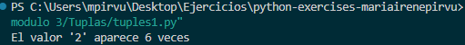

### Tuples2

```python
# Declaro la tupla
mi_tupla = (1, 2, 3, 2, 3, 1, 3, 2)

# Convierto la tupla en una lista
mi_lista = list(mi_tupla)

# Muestro por pantalla el tipo 
print(type(mi_lista))

# Muestro por pantalla la lista
print(mi_lista)
```
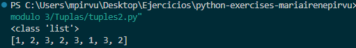

### Tuples3

```python
# Declaro la tupla
mi_tupla = (1, 2, 3, 4)

# Declaro las variables con los valores de 'mi_tupla'
a, b, c, d = mi_tupla

# Saco por pantalla el valor de las variables 'a, b , c y d'
print(a, b, c, d)
```
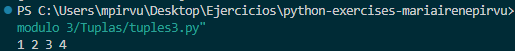


### Set1

```python
# Declaro los sets 1 y 2.
set1 = {1, 2, "tres", "cuatro"}
set2 = {"tres", 4, 5}

# Uno los dos sets en uno solo
mi_set_3= set1.union(set2)

# Imprimo el valor de 'mi_set_3' 
print(mi_set_3)

# Añado el nombre 'Damián' al set
mi_set_3.add("Damián")

# Imprimo el cambio por pantalla
print(mi_set_3)

# Elimino un elemento al azar del set 'mi_set_3'
mi_set_3.pop()

# Imprimo por pantalla el cambio
print(mi_set_3)
```

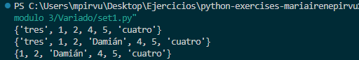

### Substring1

```python
# Declaro la variable 
frase= "Controlar la complejidad es la esencia de la programación"

# Extraigo la primera palabra teniendo en cuenta donde empieza y su número de caractertes
print(f"La primera palabra es: {frase[0:9]}")
```
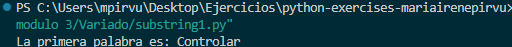

### Substring2

```python
# Declaramos la variable
frase= "Nunca confíes en un ordenador que no puedas lanzar por una ventana"

# Imprimimos por pantalla cada tercer caracter empezando por el 8. 
print(f"Los caracteres son: {frase[8::3]}")
```
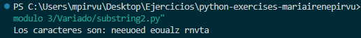

### Substring3

```python
# Declaramos la variable
frase="Es genial trabajar con ordenadores. No discuten, lo recuerdan todo y no se beben tu cerveza"

# Mostramos por pantalla la frase con los caracteres invertidos
print(f"El resultado de la inversión es: {frase[::-1]}")
```
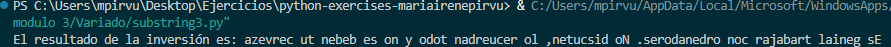

### PracticaFinal_Mod3
En este ejercicio, realizo un análisis de un texto ingresado por el usuario, identificando cuántas veces aparecen ciertas letras, el número total de palabras y la primera y última letra. Además, invierto el orden de las palabras y verifico si la palabra "Python" está presente. La frase que utilicé para la prueba fue "Este es el último ejercicio del módulo 3 de Python", con esta frase tan completa se pueden comprobar correctamente cada uno de los apartados. 

```Python
# Declaro la variable texto 
texto = input("Introduce un texto: ") 

# Declaro la variable letras 
letras = input("Introduce tres letras: ") 

# Declaramos la variable y pasamos a minusculas todo el texto.
minuscula = texto.lower()

# Declaramos las variables de las letras y las pasamos a minúsculas
letra1 = letras[0].lower()
letra2 = letras[1].lower()
letra3 = letras[2].lower()

# Sacamos por pantalla el número de veces que aparece cada letra
print(f"La letra {letra1} aparece {minuscula.count(letra1)} veces.")
print(f"La letra {letra2} aparece {minuscula.count(letra2)} veces.")
print(f"La letra {letra3} aparece {minuscula.count(letra3)} veces.")

# Divido el texto en palabras
palabras = texto.split(" ")
 
# Muestro el número total de palabras 
print(f"El número total de palabras en el texto es: {len(palabras)}")

# Declaro la variable primera 
primera = texto[0]

# Imprimo la primera letra en aparecer
print(f"La primera palabra del texto es: {primera}")

# Declaro la variable ultima 
ultima = texto[-1]

# Imprimo la última letra en aparecer
print(f"La última palabra del texto es: {ultima}")

# Invierto el orden de las palabras del texto. Utilizo la variable 'palabras' ya que esta contiene el texto separado por palabras.
invertido = " ".join(palabras[::-1])

# Imprimo el texto invertido
print(f"El texto invertido es: {invertido}")

# Verificación Python
verificacion = "Python" in texto
print(f"¿La palabra \"Python\" aparece en el texto? {verificacion}")
```

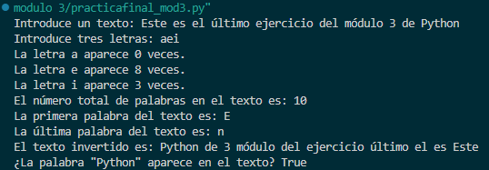