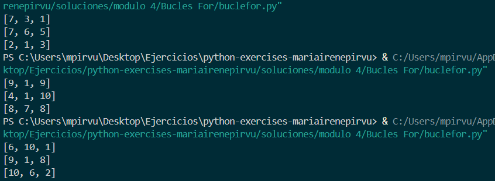
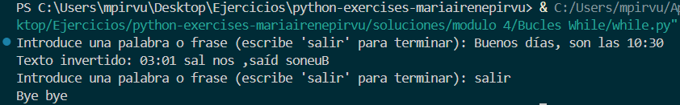
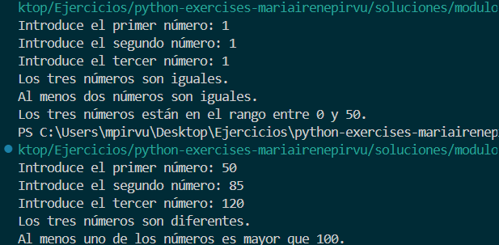
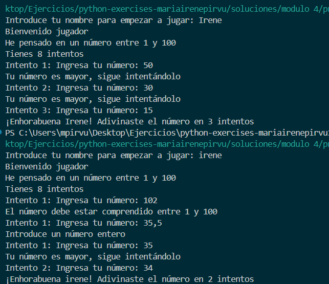

## Módulo 4

### Bucles For 
Para este ejercicio hago uso del bucle for y de la librería random. El bucle for lo utilizo para la estructura de la matriz y el random para generar números aleatorios (1-10) dentro de las filas de la matriz. 

```python
# Importamos la libreria randint
from random import randint

# Creamos la matriz
matriz = []

# Creamos un bucle for para completar la matriz 3x3 con números aleatorios.
for fila in range(3):
    # Lista vacía para cada fila de la matriz
    fila_matriz = []
    for columna in range(3):
        # Número aleatorio del 1 al 10
        aleatorio = randint(1,10)
        # Añadimos el número a la fila
        fila_matriz.append(aleatorio)
    # Añadimos la fila a la matriz
    matriz.append(fila_matriz)

# Imprimimos por pantalla la matriz 
for fila in matriz:
    print(fila)
```


### Bucles While
Este script invierte cualquier palabra o frase que escribas. Sigue funcionando hasta que escribas "salir", sin importar si usas mayúsculas o minúsculas.

```python
# Bucle que no para hasta que se escriba "salir"
while True:
    # Pide al usuario una palabra o frase
    texto = input("Introduce una palabra o frase (escribe 'salir' para terminar): ")

    # Si el usuario escribe "salir", en mayúsculas o minúsculas, se cierra el bucle
    if texto.lower() == "salir":
        print("Bye bye")
        break  # Termina el bucle

    # Invertir el texto introducido
    texto_invertido = texto[::-1]

    # Imprimimos el texto invertido
    print("Texto invertido:", texto_invertido)
```




### Comparadores y operadores 
Este script tiene en cuneta diferentes factores para cmparar 3 números entre sí. Según los números elegidos y resultados obtenidos en las comprobaciones, se muestra un mensaje u otro por pantalla. 


```python
# Pedimos al usuario 3 números
num1 = int(input("Introduce el primer número: "))
num2 = int(input("Introduce el segundo número: "))
num3 = int(input("Introduce el tercer número: "))

# Comprobación 3 números iguales
if num1 == num2 == num3:
    print("Los tres números son iguales.")

# Comprobación 3 números diferentes 
if num1 != num2 and num1 != num3 and num2 != num3:
    print("Los tres números son diferentes.")

# Comprobación 2 iguales 
if num1 == num2 or num1 == num3 or num2 == num3:
    print("Al menos dos números son iguales.")

# Comprobación 1 mayor que 100
if num1 > 100 or num2 > 100 or num3 > 100:
    print("Al menos uno de los números es mayor que 100.")

# Comprobación números entre 0 y 50 
if 0 <= num1 <= 50 and 0 <= num2 <= 50 and 0 <= num3 <= 50:
    print("Los tres números están en el rango entre 0 y 50.")
```



### Práctica final. Módulo 4
En esta práctica fusionamos lo anteriormente aprendido para crear un juego de adivinanzas. Utilizamos la biblioteca random, hacemos uso de condicionales, bucle while, operadores de comparación ...


```python
# Importamos la librería random
import random

# Pedimos el nombre del jugador
nombre = input("Introduce tu nombre para empezar a jugar: ")
print("Bienvenido jugador")

# Número secreto
numero_secreto = random.randint(1, 100)

# Reglas
print("He pensado en un número entre 1 y 100")
print("Tienes 8 intentos")

# Adivinanza. Bucle while con las condiciones
intentos = 0
max_intentos = 8

while intentos < max_intentos:
    entrada = input(f"Intento {intentos + 1}: Ingresa tu número: ")

    # Validar si lo ingresado es un número entero positivo
    if not entrada.isdigit():
        print("Introduce un número entero válido.")
        continue

    intento = int(entrada)

    if intento < 1 or intento > 100:
        print("El número debe estar comprendido entre 1 y 100.")
        continue

    intentos += 1

    if intento < numero_secreto:
        print("Tu número es menor, sigue intentándolo.")
    elif intento > numero_secreto:
        print("Tu número es mayor, sigue intentándolo.")
    else:
        print(f"¡Enhorabuena {nombre}! Adivinaste el número en {intentos} intentos.")
        break

# Mensaje de finalización si no lo adivina
if intento != numero_secreto:
    print(f"Lo siento, {nombre}. Te quedaste sin intentos.")
    print(f"El número secreto era: {numero_secreto}")
```

