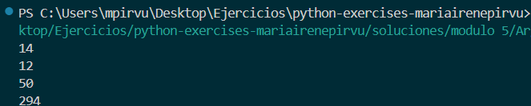
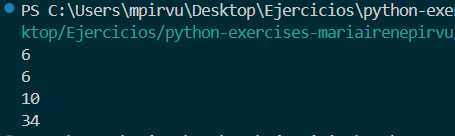

## Módulo 5

### Argumentos1

```python
# Creamos la funcion que toma argumentos
def suma_cuadrados(*numeros):
    return sum(n ** 2 for n in numeros)

# Ejemplos 
print(suma_cuadrados(1,2,3))
print(suma_cuadrados(2,2,2))
print(suma_cuadrados(5,5))
print(suma_cuadrados(7,8,9,10))
```



### Argumentos2

```python
def suma_absolutos(*numeros):
    return sum(abs(n) for n in numeros)


# Ejemplos (mismos números que en suma_cuadrados)
print(suma_absolutos(1, -2, 3))  
print(suma_absolutos(2, -2, 2)) 
print(suma_absolutos(-5, -5,))  
print(suma_absolutos(7, -8, 9, -10))
```

