# Ejercicio 01


## Instalación 

Instalo Terraform desde la página oficial haciendo uso del tutorial. 

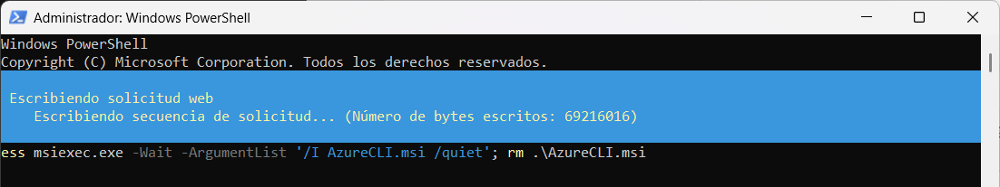

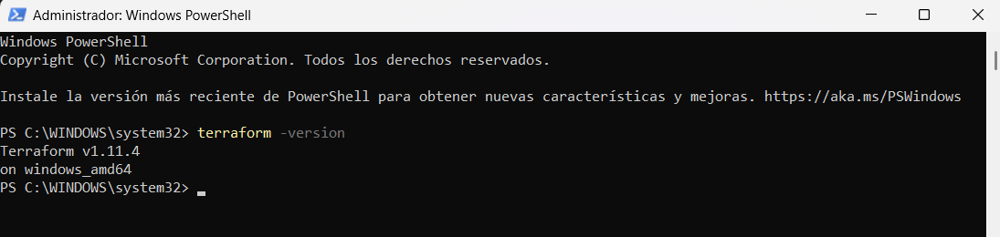

Además de Terraform, debo instalar Azure CLI. 

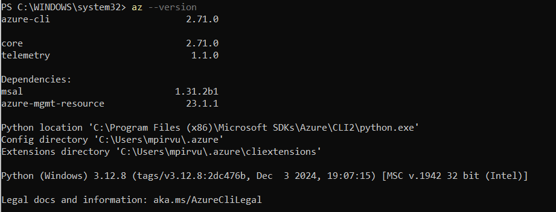


## Autenticación CLI Azure 

Ejecuto *az login* para autenticarme y selecciono mi cuenta para inciar sesión.

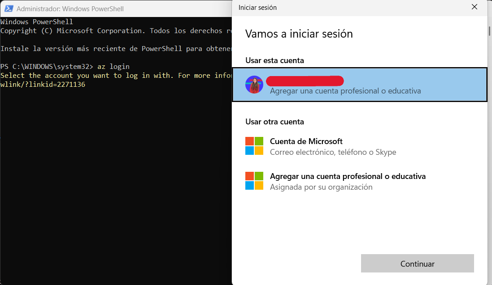

Una vez la sesión iniciada, selecciono la ID de suscripción de la cuenta. 

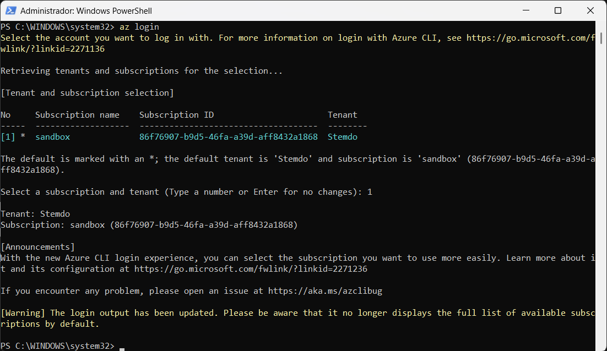


## Creación entidad de servicio

No creo la entidad de servicio ya que no tengo los permisos necesarios para ello.

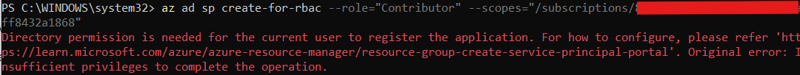

# Variables de entorno 

Necesito declarar las siguientes variables de entorno, los valores de estas los obtengo por comandos y/o dentro de Azure.

```powershell
$Env:ARM_CLIENT_ID = "<APPID_VALUE>"
$Env:ARM_CLIENT_SECRET = "<PASSWORD_VALUE>"
$Env:ARM_SUBSCRIPTION_ID = "<SUBSCRIPTION_ID>"
$Env:ARM_TENANT_ID = "<TENANT_VALUE>"
```

```powershell
 az account show 
 ```
Con este comando obtengo el subscription id y el tenant id. 
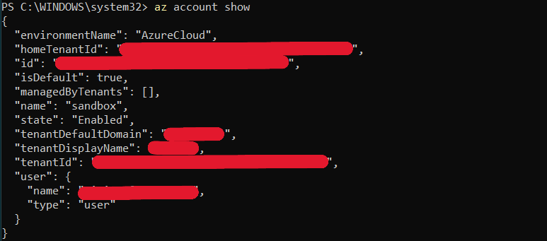

El id del cliente lo obtengo con **az ad sp list --display-name sp-mipirvu-dvfinlab-01**

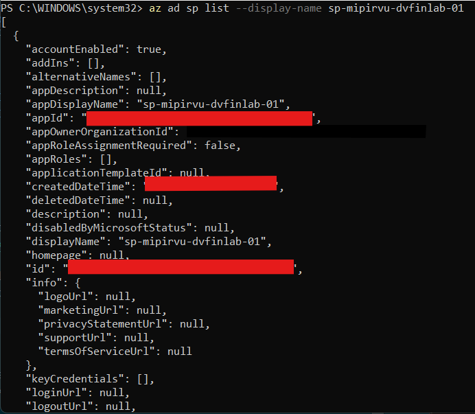


El secreto del cliente lo obtengo Azure > Grupos de recursos > Almacén de claves > Secretos 

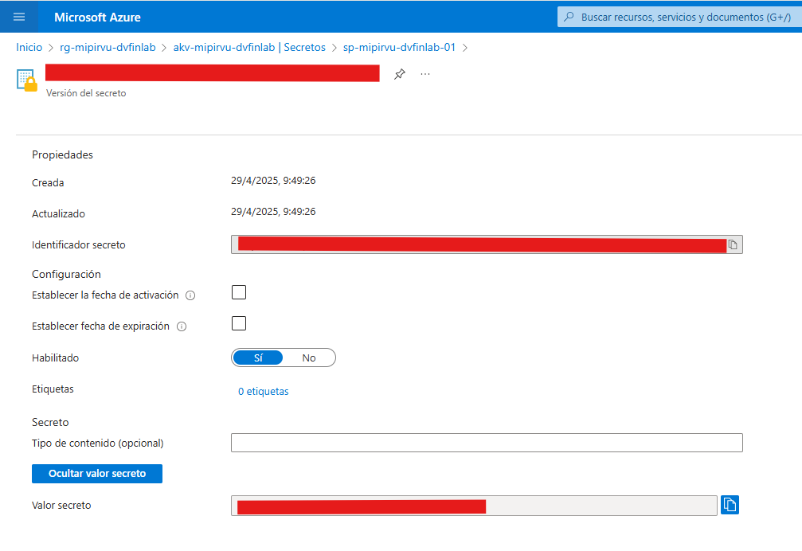


## Configuración
Creo una carpeta llamada **learn-terraform-azure**


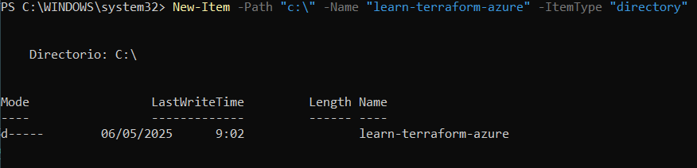

Seguidamente creo **main.tf** con la configuración de la guía. 

```hcl
# Configure the Azure provider
terraform {
  required_providers {
    azurerm = {
      source  = "hashicorp/azurerm"
      version = "~> 3.0.2"
    }
  }

  required_version = ">= 1.1.0"
}

provider "azurerm" {
  features {}
}

resource "azurerm_resource_group" "rg" {
  name     = "myTFResourceGroup"
  location = "westus2"
}
```

## Inicialización Terraform 

Una vez creada la carpeta anterior y la configuración, me dirijo a dicha carpeta y ejecuto **terraform init**

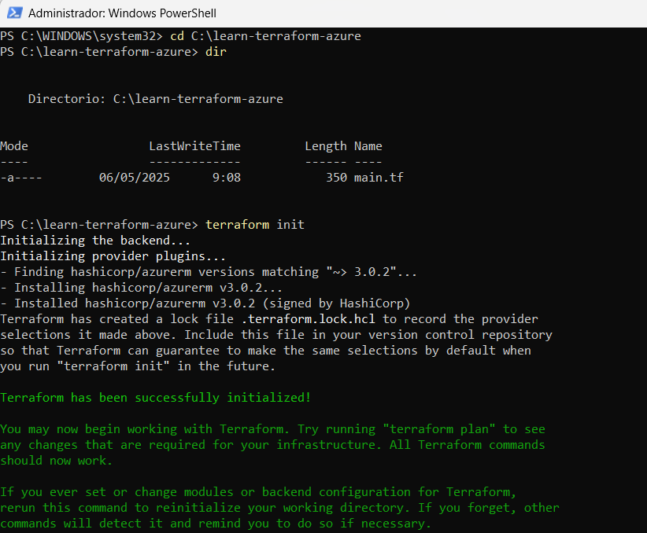

## Formateo y validación de la configuración 
Para asegurar el correcto formato y sintaxis de la configuración ejecuto los siguientes comandos:

```powershell
terraform fmt
terraform validate
```

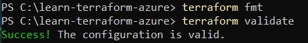

## Aplicación de la configuración 

Aplico la configuración con **terraform apply**

No obtengo el resultado esperado porque no tengo permisos. 
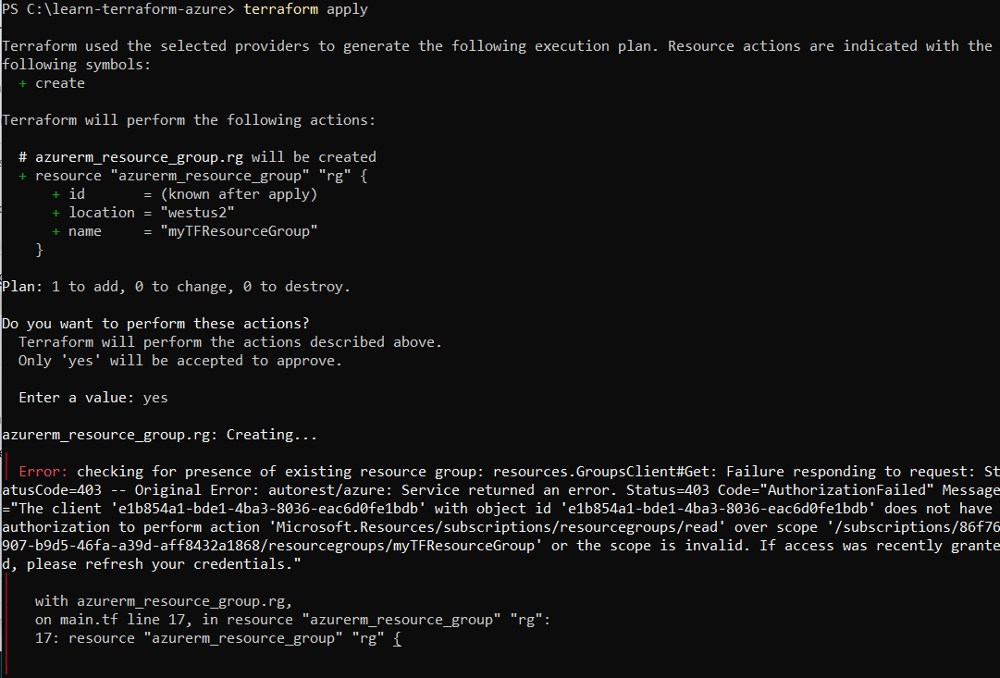

## Inspección de estado 

Al no haber obtenido el resultado deseado en el paso anterior, estos comandos no funcionarán como debería. Igualmente los ejecuto para tenerlos en cuenta posteriormente. 

```powershell
terraform show # Muestra el estado actual de la infraestructura aplicada con la configuración. Estos datos se almacenan en terraform.tfstate
terraform state list # Muestra todos los recursos que Terraform esá gestionando en su estado actual
terraform state # Muestra los recursos que conoce Terraform
```

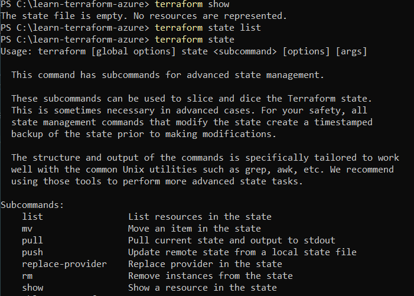

## Eliminación 
Una vez terminado el ejercicio ejecuto **terraform destroy** para eliminar todos los recursos creados. 

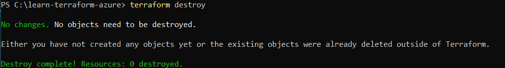