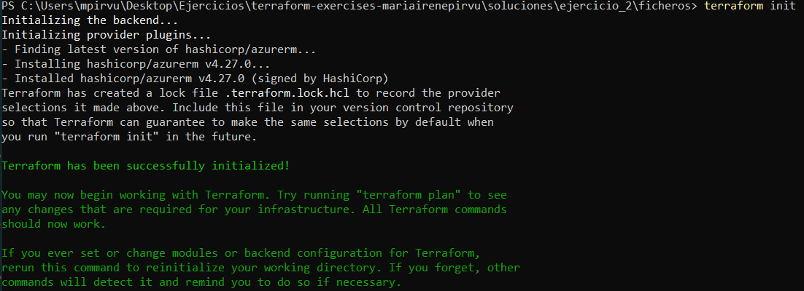
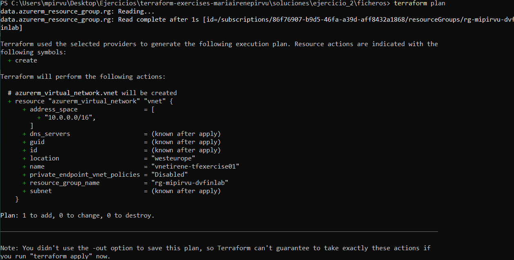
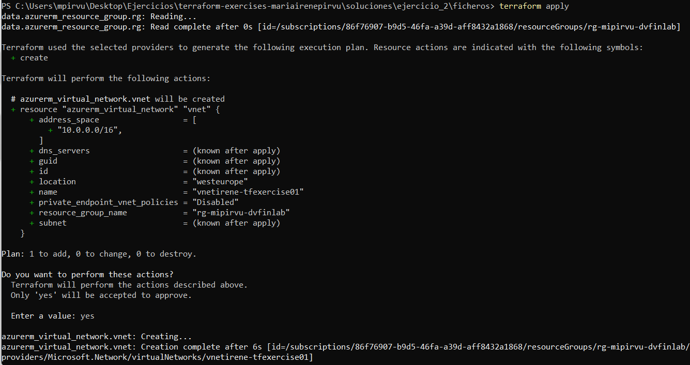
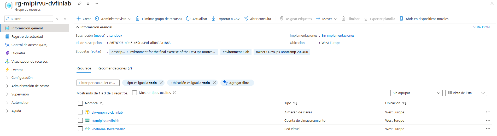
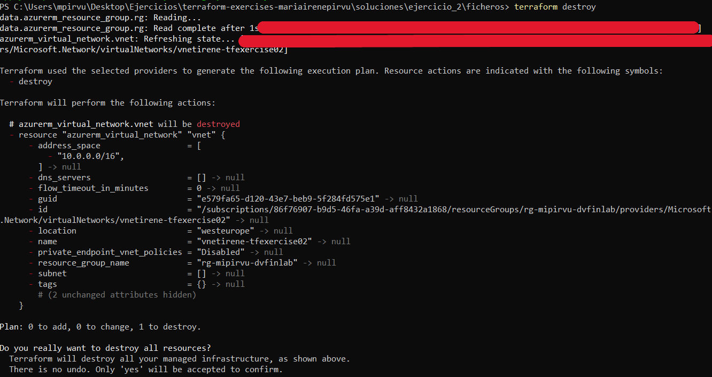

# Ejercicio 02
En este ejercicio debo desplegar una Virtual Network (VNet) en un Resource Group ya existente en Azure y haciendo uso de Terraform. 
El enunciado nos especifica una estructura concreta para **terraform.tfvars** y la existencia de la variable **location**. 

## Main 
En este archivo introducimos los recursos de terraform.

```hcl
# Proveedor Azure 
provider "azurerm" {
  features {} # Requerido por el proveedor 
}

# Obtiene información sobre un resource group
data "azurerm_resource_group" "rg" {
  name = var.existent_resource_group_name # Variable resource group
}

# Creación Virtual Network 
resource "azurerm_virtual_network" "vnet" {
  name                = var.vnet_name 
  location            = var.location
  resource_group_name = data.azurerm_resource_group.rg.name
  address_space       = var.vnet_address_space
}

```


## Variables
En este archivo definimos las variables de entrada. 
Declaro en la variable **location** como default "West Europe", como no especifico otro valor en **terraform.tfvars** el valor va a ser el predeterminado. 

```hcl
variable "existent_resource_group_name" {
  description = "Nombre del resource group ya existente"
  type        = string
}

variable "vnet_name" {
  description = "Nombre de la Virtual Network"
  type        = string
}

variable "vnet_address_space" {
  description = "Dirección CIDR de la VNet"
  type        = list(string)
}

variable "location" {
  description = "Región de Azure para desplegar la VNet"
  type        = string
  default     = "West Europe"
}

```

## Terraform.tfvars
En este archivo definimos los valores de las variables de entrada.
Sigo la estructura del enunciado modificando los valores por los míos. 

```hcl
existent_resource_group_name = "rg-mipirvu-dvfinlab"
vnet_name                    = "vnetirene-tfexercise02"
vnet_address_space           = ["10.0.0.0/16"]


```

## Terraform init

Inicializo el proyecto




## Terraform plan
Verifico la correcta configuración 



## Terraform apply
Despliego la VNet





## Terraform destroy
Elimino los recursos para seguir con las prácticas 

